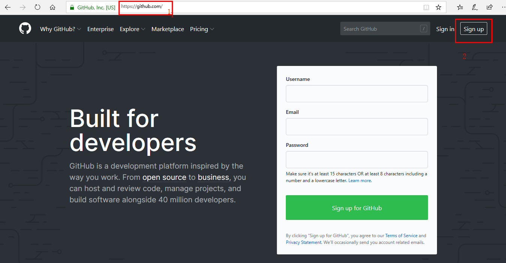
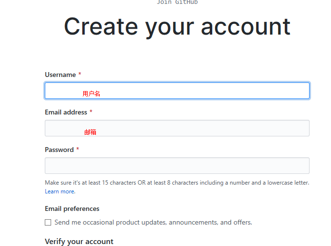
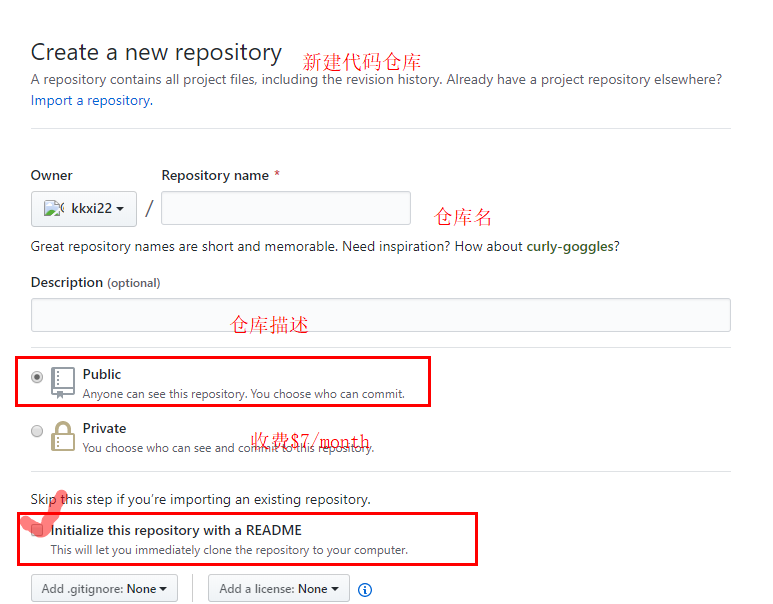
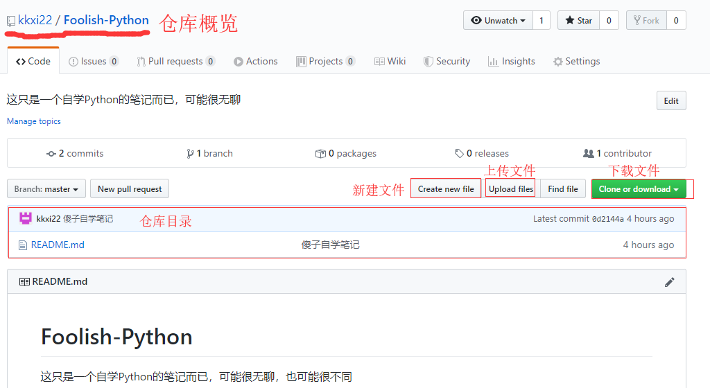
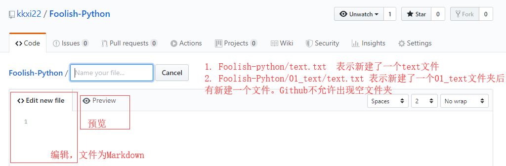
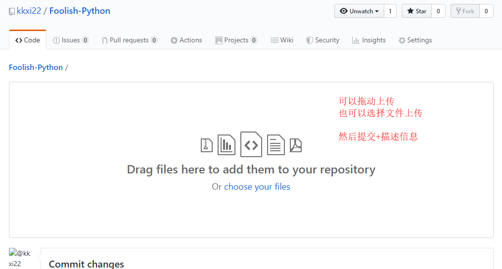
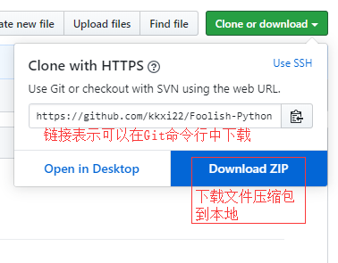

# GitHub ----全世界最大的同性交友网站

*澳门皇冠皇家赌场上线了。。。。。*

**听到这种余音袅袅、洋洋盈耳、娓娓动听的声音你是否感到激动。**

**别多想了，[GitHub](github.com)是全世界程序猿最神圣的地方，是全世界最大的代码托管网站，大多数程序猿用心血写的代码都放到[GitHub](github.com)。这是一种精神，神圣的共享、开源主义精神！**

# GitHub简介

- 1991年大名鼎鼎的[Linus]([https://baike.baidu.com/item/%E6%9E%97%E7%BA%B3%E6%96%AF%C2%B7%E6%9C%AC%E7%BA%B3%E7%AC%AC%E5%85%8B%E7%89%B9%C2%B7%E6%89%98%E7%93%A6%E5%85%B9/1034429?fromtitle=linus&fromid=400810&fr=aladdin](https://baike.baidu.com/item/林纳斯·本纳第克特·托瓦兹/1034429?fromtitle=linus&fromid=400810&fr=aladdin))创建了开源的[Linux](https://baike.baidu.com/item/linux)，现在Linux已经是最大的服务器软件系统了。
- Linux是开源的，源代码可以在官网下载。Linux的发展壮大是靠全世界程序猿的努力，可以将Linux代码的更改提交给[Linus]([https://baike.baidu.com/item/%E6%9E%97%E7%BA%B3%E6%96%AF%C2%B7%E6%9C%AC%E7%BA%B3%E7%AC%AC%E5%85%8B%E7%89%B9%C2%B7%E6%89%98%E7%93%A6%E5%85%B9/1034429?fromtitle=linus&fromid=400810&fr=aladdin](https://baike.baidu.com/item/林纳斯·本纳第克特·托瓦兹/1034429?fromtitle=linus&fromid=400810&fr=aladdin))，然后Linus会将改进代码加入到Linux中。
- 代码库之大让Linus帮派的兄弟们疲于奔命，并表示强烈不满。后来选择了商业的版本控制系统BitKeeper来方便的管理不同的代码。
- 然而，`好的程序猿都是土匪`这句话不知道谁说的，美好的局面被打破了。Linus帮派的天才太多了，有个兄弟尝试破解BitKeeper的协议，被发现了。BitKeeper母公司很生气。
- Linus代表帮派发言并道歉，保证以后严格管理帮派。
- 然而，道歉可以，改正那是不可能的。`改正是不可能改正的，一辈子都是不可能改正的`。Linus回家两周就写了一个分布式版本控制系统，就是现在Git。Git迅速成为最流行的分布式版本控制系统，无数的开源项目开始转移到[GitHub](github.com)(2008年上线)。
- 于是**就成为了全世界最大的同性交友网站**
- 2018年6月4日，[微软](https://de.wikipedia.org/wiki/Microsoft)宣布以75亿美元的价格收购GitHub。
- 在短短的10年里，GitHub 改变了人们的编程方式。 不仅让编程变得更简单，还改变了软件开发者对编程的看法。

# GitHub学习

## Git和GitHub的区别

1. Git是一款免费、开源的分布式版本控制系统（是一个软件**是爹**）
2. Github是用Git做版本控制的代码托管平台（是一个网站**是儿子**）

不联网情况下Git是本地仓库管理，Git需要很多命令管理仓库，**只记录笔记的话GitHub就足够用了，Git命令会在学完Django后学习**。

## GitHub注册

1. GitHub注册

   > https://github.com
   >
   > 

2. 填写信息

   

   3. 注册完成
## GitHub仓库及管理仓库

   1. 新建仓库

      

   2. 仓库概览

      

3. 新建文件和文件夹

   

4. 上传文件

   

5. 克隆下载文件

   

## GitHub功能

1. 关注、收藏优质代码仓库

   `watch`:关注

   `start`:收藏

2. `fork` 一个非常重要的功能

   `fork`可以别人GitHub仓库里所有的东西完整的拷贝到你的GitHub里

3. `issue`评论功能

   如果别人发现你仓库里的某一段代码不对，可以提交一个给你，会在你GitHub主页显示这个issue。然后首先你需要给别人一个回复`Thanks`，这是礼貌。解决问题后，回复修复`bug`。

4. `Pull requests`

   当你`fork`了别人的仓库，使用了一段时间别人的功能，发现某些功能或者代码可以改进，你编写了改进的代码，然后你可以`pull requests`给原作者。原作者看到并审核你的代码，很不错，更新代码库。
