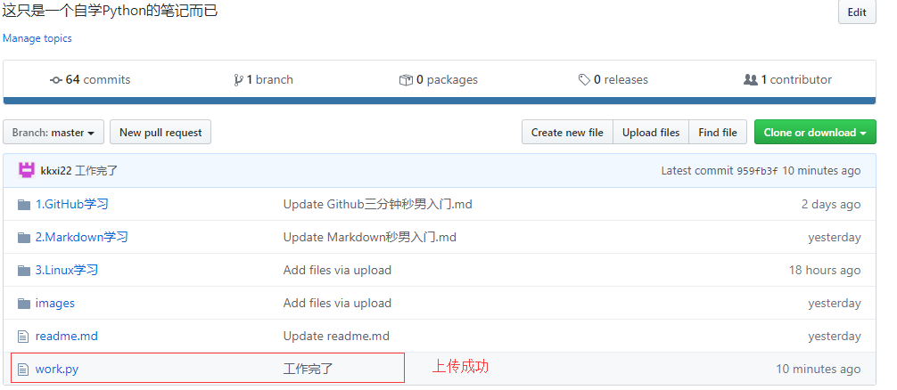

# Git命令来了

以前我们讲过*GitHub*的使用过程，这是网页版代码托管

**学习Git前最好最好先学习完Linux命令，否则还是先用GitHub吧**

Git下载网址在：https://www.git-scm.com/download/win

Git百度网盘网址在：https://pan.baidu.com/s/1LVveOMzUsOgS2qWkXAOyVQ 提取码：`sm6s`

# Git安装过程

### Windows安装Git

1.  双击下载的安装包

2.  下一步，更改安装目录

    

3.  下一步

    

4.  下一步直到这个页面

    

    5.  下面所有步骤**下一步**，直到安装完成。

    6.  验证是否安装完成

        

    ### Linux安装Git

    1.  通过`sudo apt-get uddate -y`命令更新`apt`包列表

        

    2.  然后安装Git，命令`sudo apt-get git`

        

    3.  查看Git版本`git --version`

        

# Git命令学习——本地操作

### Git基本概念

*Git*有三个区：**工作区、暂存区、和仓库**

**举个例子：**工作区就是劳动，多劳多得。占存区就是工资卡。仓库就是银行卡。*工作之后，工资卡才有钱，你才能提出放到银行卡。*

*Git*三个区的概念说白了，就是**AUTO cad工程制图时的草稿、最终完成版、打死不修改最终版**


**工作区**：就是你的工作目录，新建文件、修改文件、删除内容等，在你的D、F盘里操作。

**暂存区**：就是写好了项目代码，可能还需要修改，也许不用修改，就先放到暂存区，最后统一放到你的仓库里。

**仓库**：就是仓库。

### Git初始化设置

1.  首先在任何一个D、F盘下面新建一个文件夹`Git_test`用来测试

2.  配置用户名

    `git config --global user.name "用户名"` 可以和GitHub网页版用户名相同

    

3.  配置邮箱

    `git config --global user.email 4823947239856@qq.com`

### Git新建仓库

**初始化仓库**：`git init`    ——表示使用当前文件夹作为仓库，该命令执行完后会在当前目录生成一个 .git 隐藏目录。[运行后看不到隐藏目录请点我一下](https://jingyan.baidu.com/article/acf728fd2853fef8e410a37f.html)


### Git新建文件提交到仓库


1.  创建文件`hello.py`

    

2.  查看工作区目录文件状态

    

    并且提示，`git add <file>`可以提交文件

3.  提交到暂存区`git add hello.py`

    

4.  查看暂存区文件状态

    

5.  提交仓库`git commit -m 'add hello file'`

    

6.  `git status`查看工作区状态

    

### Git修改仓库文件

1.  查看工作区状态

    

2.  修改`hello.py`，使用`vi`，**vi的使用方法在Linux学习里**

    

    

3.  使用`git status`查看工作目录

    

4.  然后提交到暂存区`git add hello.py`，在提交到仓库`git commit -m 'moditif hello' `

### Git删除仓库文件

1.  删除文件`rm hello.py`

    

2.  删除`git`工作目录文件`git rm hello.py`

    

3.  变更提交仓库，`git commit -m 'del hello'`

    

# Git远程操作

Git远程操作可以实现多用户同步工作、多用户共同开发。

 *Git*本地操作有两步：**工作区——>>暂存区，暂存区——>>本地仓库**

*Git*远程操作需要第三步：**本地仓库——>>公司代码仓库**

### 远程演示栗子

1.  譬如侥幸进入了一家大公司做程序猿，老大给了一个任务，和同事共同开发一个项目。你需要写了**6千万行**代码实现一些功能。

2.  首先你需要把公司这个项目的代码仓库`clone`克隆到你的本地仓库中，下载的仓库里有项目框架、项目需求等。**克隆：远程仓库复制到本地仓库**

    *   随便在GitHub上找一个仓库

        

    *   在任何一个文件夹内，右键点击`Git Bash Here`输入命令`git clone https://github.com/kkxi22/Foolish-Python.git`

        

    *   克隆完成

        

3.  然后你开始工作写代码，终于在你跑了8个老婆，妻离子散后，写完了代码。都在新文件`work.py`里。

    

4.  然后使用*Git*命令先放到本地仓库，`git add work.py`，`git commit -m '工作完了'`

5.  **同步到远程仓库**`git push`——会弹出登录框

    ![]./images/clone6.png)

6.  登录

    

7.  上传完成

    

8.  上传错误问题

    **解决方法：**

    *   `vi .git/config`

    *   ```
        将
        [remote "origin"]
        	url = https://github.com/用户名/仓库名.git
        更改为：
        [remote "origin"]
        	url = https://用户名：密码@github.com/用户名/仓库名.git
        ```

# Git 搭建个人网站

**不想写了，上面那些足够用了，个人网站等用到在更新吧**
