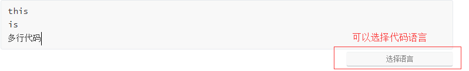
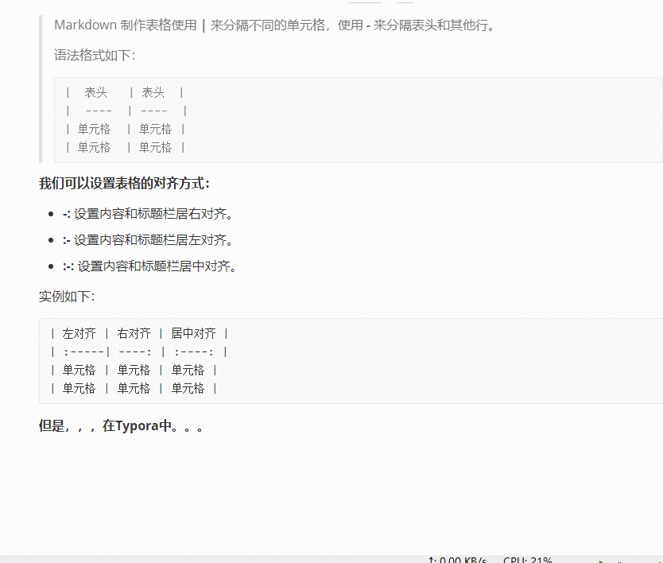

上一次，我们有了和最大同性交友网站接口，一个GitHub账号。然后我们可以用[Markdown](https://baike.baidu.com/item/markdown/3245829?fr=aladdin)写自己的笔记，然后上传到*GitHub*代码仓库里。

> Markdown是一种轻量级的标记语言，它允许人们使用易读易写的纯文本格式编写文档，借助可实现快速排版且转换成格式丰富的HTML页面。目前被越来越多的写作爱好者及工作者使用。其语法十分简单，常用标记符号少，学习时间少，一旦掌握这种标记语言，将极大提高效率。 ---- 来自于百度百科

为什么要用呢，不管它，好用就行了，程序猿都在用。鲁迅曾经说过`：程序猿说好才是真的好`


# Markdown的优点

孔子曾经说过`:用就完事了`

主要是学习速度快，秒，快

# Markdown编辑器

#### **吐血、裸奔推荐**：[Typora](https://sspai.com/post/54912)编辑器 

#### 其他种类编辑器 ---- 喜欢哪个用哪个

> ##### Mac平台：
> Mou工具：免费好用，支持实时预览，单文档，左边为编辑的Markdown语言，右边为预览效果。
>
> UlyssesⅢ：收费，支持更多写作格式，多文档支持，支持Folder、Filter的管理。
>
> 其余软件还有 iA Writer，Writer Pro等。
>
> ##### Windows端：
>
> MarkdownPad，MarkPad，马可飞象（专为印象笔记打造的编辑器），Miu，Atom，Rstudio等。
>
> ##### Linux端：
>
> Atom，ReText，UberWriter，RStudio
>
> ##### 浏览器插件：
>
> Markdown Here，MaDo (Chrome)，Marxico（Chrome）
>
> ###### Web端：
>
> 简书（支持实时预览），Draftin在线编辑器等。
>
> ##### 两款在线编辑器：
>
> [http://daringfireball.net/projects/markdown/dingus](https://link.jianshu.com?t=http://daringfireball.net/projects/markdown/dingus)
>
> [https://stackedit.io/](https://link.jianshu.com?t=https://stackedit.io/)
>
> 
>
> ---- **转自某个网站，找不到链接了，难受！！！**


# 编辑器：Typora 和MarkdownPad2

1. 两种编辑器整体对比

   

   

2. 这里选择Typora编辑器(**Typora的一些细节设计让人榴莲忘返**)

      Typora编辑器 ：`https://pan.baidu.com/s/1o5KbUSP5_Z4Ia5V_DTEF0Q `提取码：`j05r `

      MarkdownPad2：`https://pan.baidu.com/s/1TOXm8l7DTFayfEmurb3tCQ` 提取码：`dvdw`

      当然也可以自行[百度](baidu.com)安装

# Markdown 基础语法（Typora）

### 1.Markdown标题

>1.  \# 一级标题
>2.  \## 二级标题
>3.  \### 二级标题
>4.  \#### 二级标题
>5.  \##### 二级标题
>6.  \###### 二级标题

 **效果如下：**


### 2.Markdown字体

```
*斜体文本*
_斜体文本_
**粗体文本**
__粗体文本__
***粗斜体文本***
___粗斜体文本___
```

**效果如下：**

>*斜体文本*
>_斜体文本_
>**粗体文本**
>__粗体文本__
>***粗斜体文本***
>___粗斜体文本___

### 3.Markdown删除线

`~~删除线~~`   **效果---->>>>>**     ~~删除线~~

### 4.Markdown下划线

​		使用了`html`的标签`<u>使用了html的u标签</u>`

​		**效果如下：**

​		<u>使用了html的u标签</u>

### 5.Markdown链接

* 内链接

    ` 这是一个[百度](http://baidu.com)  `    **效果---->>>>>**   这是一个 [百度](http://baidu.com)  

* 外链接

    ```
    学习好累啊，不是为了写博客根本学不下去，想玩[游戏](1)
    [1]: 来玩游戏啊，网址是po**hub.com
    ```
    
    **效果如下：**
    
    学习好累啊，不是为了写博客根本学不下去，想玩[游戏](1)
    
    [1]: 来玩游戏啊，网址是po**hub.com

*   脚注

    `罐装病毒赶紧滚蛋啊[^virus]`

    **效果如下：**

    罐装病毒赶紧滚蛋啊[^ virus]

    [^virus]: 吃野味犯法

### 6. Markdown插入图片

```


```

``这里使用的是相对路径

也可以使用绝对路径`F:\Git\2.Markdown学习\images\freeeggs.jpg`

​		**相对、绝对路径会在Linux中详述**

**效果如下：**


**幸福的是在Typora里你还可以改变图片：**


在上面的动图中，你也许看到了，当你输入`Markdown字符`会得到`html`代码，其基本的原理就是解析`html`代码。**`html`代码会在web前端学习中详细列出**，现在不懂也没事。

### 7.Markdown代码

*   单行代码使用   **\`this is 单行代码\`**     **效果---->>>>>**    `this is 单行代码`

*   对行代码块使用 

    \`\`\`

    this 

    is 

    多行代码

    \`\`\`

    **效果如下：**

    ```
    this
    is 
    多行代码
    ```

    

### 8.Markdown区块

当你引用了别人的话怎么办呢，就使用区块。**行开头使用   \>  **

```
>泪目！#英雄回家路#[心] 
>近日，来自全国的医疗队陆续开启了返程回家路。
>“再见啦战友们”“武汉人民真的很英雄”“感谢你们对湖北的贡献”
>各地最高礼遇迎接援鄂医护回家
>谢谢你们为我们拼过命，我们会永远记得
```

**效果如下：**

>泪目！#英雄回家路#[心] 
>近日，来自全国的医疗队陆续开启了返程回家路。
>“再见啦战友们”“武汉人民真的很英雄”“感谢你们对湖北的贡献”
>各地最高礼遇迎接援鄂医护回家
>谢谢你们为我们拼过命，我们会永远记得

### 9.Markdown列表

**无序列表**

```
* 1
* 2
* 3

- 11
- 22
- 33

+ 111
+ 222
+ 333
```

* 1
* 2
* 3

- 11
- 22
- 33

+ 111
+ 222
+ 333

**有序列表**

```
1. 翻墙
2. 输入网址
3. happy
```

1. 翻墙
2. 输入网址
3. happy

### 10.Markdown表格

Markdown表格有点麻烦，但是在Typora中使用快捷键<kbd>ctrl</kbd>`+`<kbd>t</kbd>会自动生成表格

>Markdown 制作表格使用 **|** 来分隔不同的单元格，使用 **-** 来分隔表头和其他行。
>
>语法格式如下：
>
>```
>|  表头   | 表头  |
>|  ----  | ----  |
>| 单元格  | 单元格 |
>| 单元格  | 单元格 |
>```

**我们可以设置表格的对齐方式：**

-   **-:** 设置内容和标题栏居右对齐。
-   **:-** 设置内容和标题栏居左对齐。
-   **:-:** 设置内容和标题栏居中对齐。

实例如下：

```
| 左对齐 | 右对齐 | 居中对齐 |
| :-----| ----: | :----: |
| 单元格 | 单元格 | 单元格 |
| 单元格 | 单元格 | 单元格 |
```

**但是，，，在Typora中<kbd>ctrl</kbd>`+`<kbd>t</kbd>。。。**



# End

以上简单Markdown用法已经基本够用了，Markdown高级用法当我们使用到是会补充到。

现在可以试试在自己的GitHub里写第一个`readme.md`了