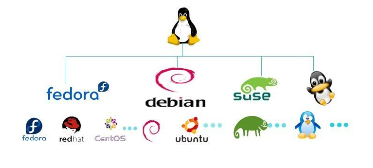
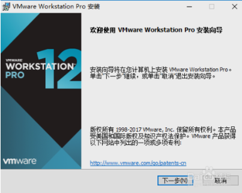
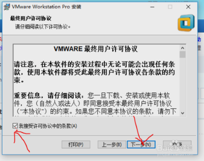
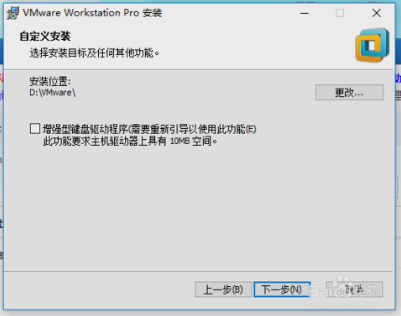
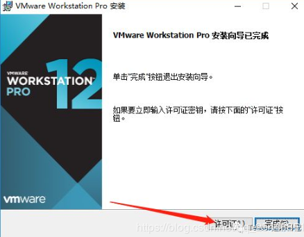
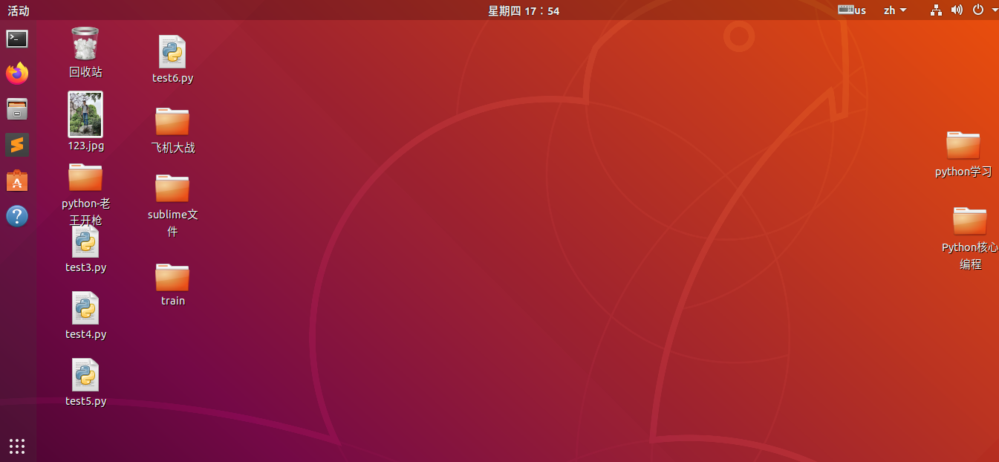
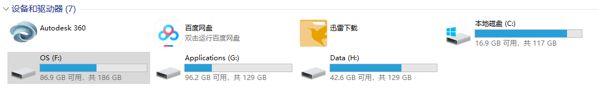
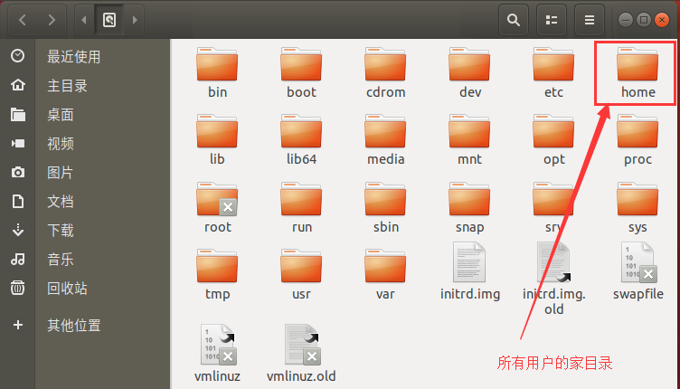

# 认识Linux

**为什么要学Linux呢？因为程序猿必须必须必须一定一定一定要会**

**挺想说说Linux历史的，但是篇幅太长了，先直接上干货。历史以后更新，学习累了可以看看**

*Linux*和*windows*一样是操作系统，只不过*Windows*适合桌面应用，*Linux*适合做服务器。

所以生活中不常见*Linux*系统的电脑，一直是*Windows*统治桌面操作系统。由于计算机发展，计算机课程都开放到了小学里，从小培养娃，还有很多人自学了计算机，社会上整体的计算机水平有所提高。华为去年推出了几款Linux系统的笔记本，效果也不错。**Windows更加图形化，而Linux更加的偏向使用命令。**

# 安装Linux系统

本机*Windows10*系统，想要装*Linux*有两种方法

1.  直接安装会覆盖掉*Windows10*，从而你的电脑彻底变成*Linux*系统了
2.  可以安装**VMware Workstation**虚拟机，然后在软件上安装Linux系统（**Ubuntu**），**推荐**

### 一、安装VMware Workstation

1.  **干货地址**

    `链接：https://pan.baidu.com/s/1ad5m7ZVWh-AiBhGXE1umIg 提取码：bttq `

    安装过程来自百度经验，**不想卸载重装了**

2.  打开下载的可执行文件`.exe`

    

3.  同意许可，下一步

    

4.  更改安装目录

    

5.  最好取消自动更新，创建桌面快捷方式，然后点击安装

6.  安装完成后点击**许可证**，输入下载的文件里的**key**文件夹里的许可证

    

    

7.  完成安装。

### 二、安装Ubuntu

1.  Ubuntu干货地址

    `链接：https://pan.baidu.com/s/1d5y0X4KP4jWlfFnh2q_PbA 提取码：dhg1`

2.  **本来我打算自己写安装教程的，但是简书上`记忆朔行`写的太全面了**

    很是崇拜羡慕，自己就不写了，给出地址**`https://www.jianshu.com/p/faf8bbbdd0f2`**

3.  安装后界面如下

    

# Linux与Windows目录的区别

1.  *Windows*是单用户操作系统

    分C、D、F等盘符，C盘存操作系统文件，其他文件放在D、F。**只能一个人使用——单用户**

    

2.  Linux是多用户操作系统

    可以多个用户一起操作，它的最高级目录就是`/`——根目录

    

最高级目录`/`下面`home`就是用户的家目录，所用的用户都在这里。

**举个栗子：**你被一家大公司录取了，一般大公司代码严格保密，不允许你把代码带出公司，所以你只能在公司发给你的电脑上工作，而且只能用公司的网登陆服务器，服务器都是*Linux*操作系统。所以，你入职的第一天就会发给你注册一个账号，比如叫账号：`python9`，密码：`hahahaha`。而这个账号就会出现在上图中的`/home`文件夹里，你所写的代码也都在`/home/pyhton9`里。你同事当然也一样，都是`/home`里的一员。**这就是多用户操作**

**除了`home`，其他的每个目录都有各自的含义，对于我们小白来说，先不理他**