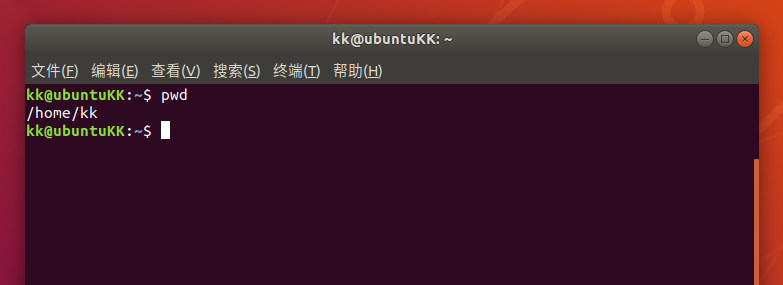
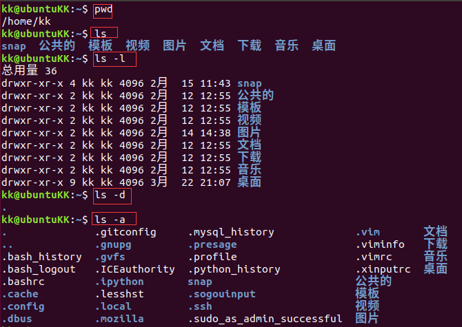
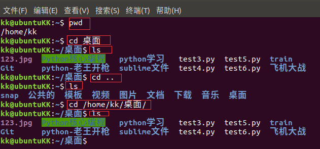

# Linux基础命令

打开安装好的Ubuntu终端，开启新世界大门吧

*linux*命令的格式：

​		[命令]  -选项  [参数1，参数2。。。]

1.  `pwd`——*print working directory***打印工作目录**，即打印当前工作目录（常用）

    

2.  `ls`——*list*的缩写，表示**列出当前目录下的文件**

    *   `ls -a` ：全部的文件，连同隐藏文件( 开头为 . 的文件) 一起列出来(常用)

    *   `ls -d` ：仅列出目录本身，而不是列出目录内的文件数据(常用)

    *   `ls -l` ：长数据串列出，包含文件的属性与权限等等数据；(常用)

    *   `ls -al`:  结合`a`和`l`

        

3.  `cd`——*change directory***切换目录**

    `cd [相对路径或者绝对路径]`

    在Linux中，`./`表示点前目录，`../`上一级目录

    相对路径：`./test.txt`

    绝对路径：`/home/kk/Desktop/test.txt`

    *   `cd ..`切换上一级目录

    *   `cd /home/kk/Desktop/`切换根目录下的家目录里的kk用户里的桌面下

    *   `cd ~`直接切换到用户家目录，不管现在在哪个目录

    *   `cd -`切换上一次跳转的目录

        

4.  `mkdir`——*make directory***创建新目录**

    `mkdir [目录名]`

    `mkdir -p a/b/c/d`   -p表示创建多层目录

5.  `rmdir`——*remove directory***删除目录**

    `rmdir [目录名]`

    `rmdir -p a/b/c/d`删除多层目录

    `rmdir -r [目录]`强制删除目录

6.  `cp`——*copy***复制**

    `copy [路径/源文档] [路径/]`

    比如 `cp ./test.txt /home/kk/Desktop/`

7.  `rm`——remove**删除文件**

    `rm ./test.txt`

    `rm -r ./test.txt`强制删除文件

    **小技巧**

    *   你入职一家大公司程序猿，侥幸获得了`root`超级用户权限。你输入`rm -rf *`，**然后被判10年有期徒刑**

    *   不要对你自己的电脑用`sudo rm -rf *`，除非你想重新装一遍Ubuntu。

8.  `mv`——*move***移动文件或者目录，也可以修改文件名**

    `mv ./test.txt /home/kk/Desktop/`移动文件

    `mv test/txt 123.txt`修改文件名为*123.txt*

9.  `cat`和`tac`——**查看文件内容**

    `cat`从文件开头查看

    `tac`从文件结尾查看

    `cat -n ./123.txt`查看123.txt并显示行号

10.  `more`——**翻页方式查看文件内容**

     >在 more 这个程序的运行过程中，你有几个按键可以按的：
     >
     >-   空白键 (space)：代表向下翻一页；
     >-   Enter     ：代表向下翻『一行』；
     >-   /字串     ：代表在这个显示的内容当中，向下搜寻『字串』这个关键字；
     >-   :f      ：立刻显示出档名以及目前显示的行数；
     >-   q       ：代表立刻离开 more ，不再显示该文件内容。
     >-   b 或 [ctrl]-b ：代表往回翻页，不过这动作只对文件有用，对管线无用。

11.  `grep`——**搜索工具**

     ```
     grep [-选项] ‘搜索内容串’文件名
     ```

     | -n   | 显示匹配行及行号 |
     | ---- | ---------------- |
     | -i   | 忽略大小写       |

     grep搜索内容串可以是正则表达式。

     grep常用正则表达式：

     | 参数         | 含义                                                         |
     | :----------- | ------------------------------------------------------------ |
     | ^a           | 行首,搜寻以 m 开头的行；grep -n '^a' 1.txt                   |
     | ke$          | 行尾,搜寻以 ke 结束的行；grep -n 'ke$' 1.txt                 |
     | [Ss]igna[Ll] | 匹配 [] 里中一系列字符中的一个；搜寻匹配单词signal、signaL、Signal、SignaL的行；grep -n '[Ss]igna[Ll]' 1.txt |
     | .            | (点)匹配一个非换行符的字符；匹配 e 和 e 之间有任意一个字符，可以匹配 eee，eae，eve，但是不匹配 ee，eaae；grep -n 'e.e' 1.txt |

     

12.  `clear`——**清屏**

13.  `|`——**管道**

     理解为生活中的管子，一遍进水一遍出水。**即一遍写内容，一遍读取**

     `ls -al | more`先出当前目录里所用文件，放进管道，如果文件很多，`more` 命令会一页一页显示文件。
     
14.  `ln`——**链接**

     *   软链接：软链接不占用磁盘空间，源文件删除则软链接失效。

     *   硬链接：硬链接只能链接普通文件，不能链接目录。

     ```
     ln 源文件 链接文件
     ln -s 源文件 链接文件
     ```

     如果没有`-s`选项代表建立一个硬链接文件，两个文件占用相同大小的硬盘空间，即使删除了源文件，链接文件还是存在，所以-s选项是更常见的形式。

     **注意：如果软链接文件和源文件不在同一个目录，源文件要使用绝对路径，不能使用相对路径。**

15.  `find`——**查找**

     | find ./ -name test.sh       | 查找当前目录下所有名为test.sh的文件    |
     | --------------------------- | -------------------------------------- |
     | find ./ -name '*.sh'        | 查找当前目录下所有后缀为.sh的文件      |
     | find ./ -name "[A-Z]*"      | 查找当前目录下所有以大写字母开头的文件 |
     | find /tmp -size 2M          | 查找在/tmp 目录下等于2M的文件          |
     | find /tmp -size +2M         | 查找在/tmp 目录下大于2M的文件          |
     | find /tmp -size -2M         | 查找在/tmp 目录下小于2M的文件          |
     | find ./ -size +4k -size -5M | 查找当前目录下大于4k，小于5M的文件     |
     | find ./ -perm 0777          | 查找当前目录下权限为 777 的文件或目录  |

16.  归档、解压

     | `tar -cvf test.tar ./`  | 将当前目录下所有文件归档 |
     | :---------------------: | :----------------------: |
     | `tar -xvf test.tar ./`  |   将`test.tar`文件结档   |
     | `tar -zcvf test.tar ./` | 将当前目录下所有文件压缩 |
     | `tar -zxvf test.tar ./` |  将`test.tar`文件解压缩  |

