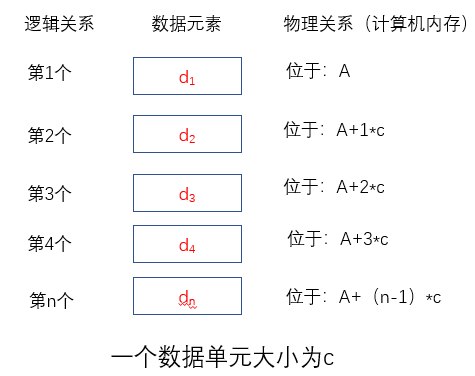
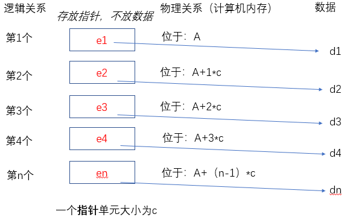
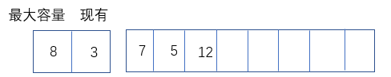
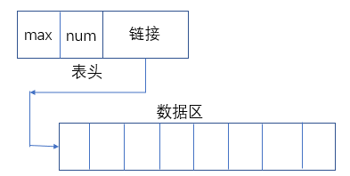
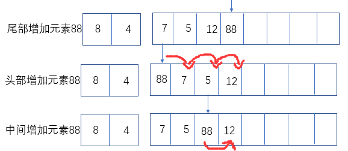

# 线性表

前面说过数据结构分为线性表和非线性表

什么是线性表呢？

一个班级的学号就可以用线性表存储，学号和学生一一对应，即用元素的位置和顺序与数据以一对用，构成相互关系，这就是**线性表**。**线性表**是一类元素的集合，比如学号（学生的集合），同时记录着数据之间的关系和顺序。**线性表是最基本的数据结构，程序中应用的最广泛，也是很多其他复杂数据结构的基础。**

线性表有分为**顺序表和链表**，只是在计算机内存中的存放方式不同。

**1. 顺序表**——是将数据整体按顺序存放在计算机内存中，所消耗的内存是一个整体。

**2. 链表**——顾名思义，数据逻辑结构依然是依次排列，只是在内存中并不是一个整体，数据放置位置不同，但是将所有数据用指针链接起来。

# 顺序表

>顺序表是在计算机内存中以**数组**的形式保存的线性表，线性表的顺序存储是指用一组地址连续的存储单元依次存储线性表中的各个元素、使得线性表中在逻辑结构上相邻的数据元素存储在相邻的物理存储单元中，即通过数据元素物理存储的相邻关系来反映数据元素之间逻辑上的相邻关系，采用顺序存储结构的线性表通常称为顺序表。顺序表是将表中的结点依次存放在计算机内存中一组地址连续的存储单元中。  ————百度百科

*NOTE：在Python中没有数组，使用了列表和元组替代。*



在上图中，是顺序表在内存中的存放方式，数据本身是连续的，可以根据数据起始存放位置、数据单元大小，数据顺序计算出每一个数据的位置。公式$A+(n-1)*c$。

因此，想要访问某个数据时，不用逐个遍历，可以直接输入元素位置即可，所以时间复杂度为O(1)。

```
# 比如
a = [1,2,3,5,6,7,9,3,2]
a[5]  # 值为7    ——直接通过元素的下标得到，不用遍历所有的元素。
```

**思考：上面是每个数据单元c大小相同，如果每个数据单元c大小不同怎直接得到呢？**



当数据`d1,d2,d3,d4...dn`在内存中大小不一样时，采取数据外置的方法。把每个数据的指针放在物理内存中，访问指定元素时，先访问指针，在找到指定数据。**c不再是数据的大小，而是数据指针的大小，通常这个量很小。**

# 顺序表的结构

顺序表是数据在内存中整体存储。其实顺序表需要表头信息，表示这个顺序表的最大容量，现有元素个数等信息。



上面是表头和数据整体在内存中一起存放，为一体式顺序表。



分离式顺序表，表头通过指针链接数据区。

**区别**

* 一体式顺序表，表头和数据区为一个整体存储，顺序表确定，数据整体就固定下来。想要增加更多数据只能整体迁移到更大的一体式顺序表。优点整体性强，缺点扩容不方便。
* 分离式顺序表，可以扩大数据区，而不改变原有数据对象，只要计算机还有内存都可以随意操作。所以也把这种顺序表叫做动态顺序表，表示其容量可以随意扩充。

**顺序表的两种扩充方法**

* 每次扩充增加固定数量内存单元。比如每次增加10个单元，叫做线性增长。
* 每次扩充增加一倍内存单元。【推荐】

# 顺序表的数据处理方法

### 增加元素

* 从尾部增加元素，时间复杂度为O(1)。
* 从头部增加元素，时间复杂度为O(n)。
* 从中间插入元素，时间复杂度为O(n)。（用最坏时间复杂度）



### 删除元素

* 从尾部删除元素，时间复杂度为O(1)。
* 从头部删除元素，时间复杂度为O(n)。
* 从中间删除元素，时间复杂度为O(n)。（用最坏时间复杂度）

# Python中list原理

Python中列表和元素采用了顺序表的技术实现，元组是不可变类型的顺序表，除了不支持改变其内部状态，即元组不能修改，其他操作与列表相同。

Python中封装的标准列表就是**采用的分离式技术动态顺序表**，列表里数据大小可变化，通过下标即可快速访问元素，时间复杂度O(1)。

*list*允许加入元素，随着元素加入，表对象`id `不发生变化。

```
In [1]: a = [1,2,3,4]
In [2]: id(a)
Out[2]: 2484801262088

In [3]: a.append(9)
In [4]: a.append(10)
In [5]: a
Out[5]: [1, 2, 3, 4, 9, 10]

In [6]: id(a)
Out[6]: 2484801262088
```

原理：当新建一个空列表，只分配8个元素的空间。当数据满了，会换一块4倍大小的空间。如果列表已经很大很大了（超过了50000），每次只扩大一倍的空间。引入这种改变策略的方式，是为了避免出现过多空闲的存储位置。