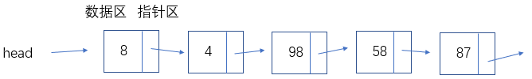
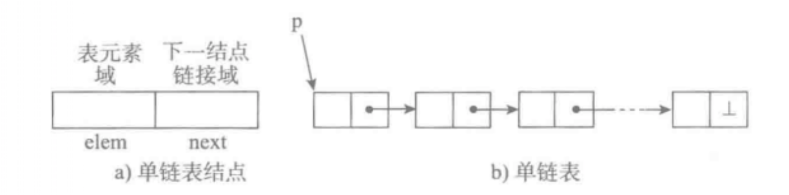

# 链表

顺序表在使用时需要预先知道数据的大小，然后分配内存空间。扩容时需要进行数据迁移，使用很不方便。

链表在内存中可以不连续、不按顺序的存储数据，数据之间的关联是通过**指针**连接的。每一个元素叫做一个节点，节点又数据和指针组成。比如酒店房间和门牌号的关系。链表能够更好的利用内存空间，实现灵活内存的动态管理。但是链表失去了随机读取的优点，也增加了内存的开销。

#### 链表的定义

链表（Linked list）是一种常见的基础数据结构，是一种线性表，但是不像顺序表一样连续存储数据，而是在每一个节点（数据存储单元）里存放下一个节点的位置信息（即地址）。



# 链表分类

## （一） 单向链表

单向链表也叫单链表，是链表中最简单的一种形式，它的每个节点包含两个域，一个信息域（元素域）和一个链接域。这个链接指向链表中的下一个节点，而最后一个节点的链接域则指向一个空值。



* 表元素域elem用来存放具体的数据。

- 链接域next用来存放下一个节点的位置（python中的标识）
- 变量p指向链表的头节点（首节点）的位置，从p出发能找到表中的任意节点。

### 创建节点类

节点有两个属性，数据和指针。因此在创建类的时候，初始化两个属性。

```
class Node(object):
    """节点类"""
    def __init__(self, node):
        self.node = node  # 节点的数据
        self.next = None  # 节点的指针，默认为指向空
```

### 单链表的功能

需要实现以下功能，如何用Python编写程序呢？

-  判断链表是否为空
- 得到链表长度
- 遍历整个链表
- 头部添加元素
-  尾部添加元素
- 指定位置添加元素
-  删除节点
-  查找节点

####  判断链表是否为空

已经创建好节点类

```
class SingeList(object):
    """单向列表的功能"""
    def __init__(self):
        self.head = None  # 初始化头部指向

    def is_empty(self):
        # if self.head == None:  # 判断头部是不是None 
        #     return True
        # else:
        #     return False
        return self.head == None  # 上面4行可以简写为一行，结果相同
```

**NOTE**：在PEP8中，`self.head == None`一个变量等于`None`，应该写成`self.head is None`，下面代码都会按标准来写。

```
    def is_empty(self):
        # if self.head is None:  
        #     return True
        # else:
        #     return False
        return self.head is None
```

####  得到链表长度

```
    def length(self):
        # 得到链表长度
        cur = self.__head  # 创建一个标记，指向头部
        count = 0  # 计数变量
        while cur is not None:  # 如果标记指向不是None
            cur = cur.next  # 让标记后移一个节点
            count += 1  # 并且计数加1
        return count  # 最后返回总计数 
```

#### 遍历列表

```
    def travel(self):
        # 遍历列表
        if self.is_empty():  # 遍历之前判断空列表
            print("空列表")
        else:
            cur = self.__head
            while cur is not None:
                print(cur.node, end=",")
                cur = cur.next
            print()
```

#### 头部添加元素

```
def add(self, data):
    # 头部添加元素
    node = Node(data)  # 创建节点
    node.next = self.__head  # 让新节点指向初始头部的指向
    self.__head = node  # 在让头部指向新节点
```

#### 上面四个功能测试

```
class Node(object):
    """节点类"""
    def __init__(self, elem):
        self.elem = elem  # 节点的数据
        self.next = None  # 节点的指针，默认为指向空


class SingeList(object):
    """单向列表的功能"""
    def __init__(self):
        self.__head = None

    def is_empty(self):
        # 判断链表是否为空
        # if self.head == None:
        #     return True
        # else:
        #     return False
        return self.__head is None

    def length(self):
        # 得到链表长度
        cur = self.__head  # 创建一个标记，指向头部
        count = 0  # 计数变量
        while cur is not None:  # 如果标记指向不是None
            cur = cur.next  # 让标记后移一个节点
            count += 1  # 并且计数加1
        return count  # 最后返回总计数

    def travel(self):
        # 遍历列表
        if self.is_empty():  # 遍历之前判断空列表
            print("空列表")
        else:
            cur = self.__head
            while cur is not None:
                print(cur.elem, end=",")
                cur = cur.next
            print()

    def add(self, data):
        # 头部添加元素
        node = Node(data)  # 创建节点
        node.next = self.__head  # 让新节点指向初始头部的指向
        self.__head = node  # 在让头部指向新节点


aList = SingeList()  # 创建链表对象
print(aList.is_empty())  # 空列表判断
print(aList.length())  # 空列表长度
aList.travel()  # 空列表遍历

aList.add(5)  # 头部添加元素
aList.add(3)  # 再头部添加一个
print(aList.is_empty())  # 判断是否为空
print(aList.length())  # 得到长度
aList.travel()  # 遍历
```

**结果**

```
True
0
空列表

False
2
3,5,
```

#### 尾部添加元素

```
    def append(self, data):
        # 尾部添加元素
        node = Node(data)  # 创建新节点
        if self.is_empty():  # 如果是空列表
            # self.add(data)  #调用头部添加函数
            self.__head = node
        else:
            cur = self.__head
            while cur.next is not None:  # 判断标记的下一个节点是不是为None
                cur = cur.next  # 不是继续移动标记
            cur.next = node  # 是，让标记指针指向新节点
```

#### 指定位置添加元素

```
    def insert(self, position, data):
        # 指定位置插入
        if position <= 0:  # 如果指定位置小于等于0，调用头部出入函数
            self.add(data)
        elif position > (self.length()-1):  # 如果指定位置大于self.length()-1
            self.append(data)  # 调用尾部插入函数
        else:
            node = Node(data)  # 创建新节点
            pre = self.__head  # 创建当前节点的前一个节点
            count = 0
            while count < position - 1:  
                pre = pre.next
                count += 1
            node.next = pre.next  # 新节点的指针指向pre指向的那个节点
            pre.next = node  # pre指针指向新节点
```

#### 删除节点

```
    def remove(self, data):
        # 删除节点
        cur = self.__head
        pre = None
        while cur is not None:
            if cur.elem == data:  # 如果当前节点数据和删除数据相等
                if pre is None:   # 如果pre == None，说明是第一个节点
                    self.__head = cur.next
                else:
                    pre.next = cur.next
            else:  # 继续移动标记
                pre = cur
                cur = cur.next
```

#### 查找节点

```
    def search(self, data):
        # 查找节点
        cur = self.__head
        while cur is not None:
            if cur.elem == data:  # 如果当前节点数据和查找数据相等
                print("找到数据")
                return
            cur = cur.next
        print("未找到%d" % data)
```

## 单向列表功能汇总

```
class Node(object):
    """节点类"""
    def __init__(self, elem):
        self.elem = elem  # 节点的数据
        self.next = None  # 节点的指针，默认为指向空


class SingeList(object):
    """单向列表的功能"""
    def __init__(self):
        self.__head = None

    def is_empty(self):
        # 判断链表是否为空
        # if self.head == None:
        #     return True
        # else:
        #     return False
        return self.__head is None

    def length(self):
        # 得到链表长度
        cur = self.__head  # 创建一个标记，指向头部
        count = 0  # 计数变量
        while cur is not None:  # 如果标记指向不是None
            cur = cur.next  # 让标记后移一个节点
            count += 1  # 并且计数加1
        return count  # 最后返回总计数

    def travel(self):
        # 遍历列表
        if self.is_empty():  # 遍历之前判断空列表
            print("空列表")
        else:
            cur = self.__head
            while cur is not None:
                print(cur.elem, end=",")
                cur = cur.next
            print()

    def add(self, data):
        # 头部添加元素
        node = Node(data)  # 创建节点
        node.next = self.__head  # 让新节点指向初始头部的指向
        self.__head = node  # 在让头部指向新节点

    def append(self, data):
        # 尾部添加元素
        node = Node(data)  # 创建新节点
        if self.is_empty():  # 如果是空列表
            # self.add(data)  #调用头部添加函数
            self.__head = node
        else:
            cur = self.__head
            while cur.next is not None:  # 判断标记的下一个节点是不是为None
                cur = cur.next  # 不是继续移动标记
            cur.next = node  # 是，让标记指针指向新节点

    def insert(self, position, data):
        # 指定位置插入
        if position <= 0:  # 如果指定位置小于等于0，调用头部出入函数
            self.add(data)
        elif position > (self.length()-1):  # 如果指定位置大于self.length()-1
            self.append(data)  # 调用尾部插入函数
        else:
            node = Node(data)  # 创建新节点
            pre = self.__head  # 创建当前节点的前一个节点
            count = 0
            while count < position - 1:
                pre = pre.next
                count += 1
            node.next = pre.next  # 新节点的指针指向pre指向的那个节点
            pre.next = node  # pre指针指向新节点

    def remove(self, data):
        # 删除节点
        cur = self.__head
        pre = None
        while cur is not None:
            if cur.elem == data:  # 如果当前节点数据和删除数据相等
                if pre is None:   # 如果pre == None，说明是第一个节点
                    self.__head = cur.next
                    return "已删除"
                else:
                    pre.next = cur.next
                    return "已删除"
            else:  # 继续移动标记
                pre = cur
                cur = cur.next

    def search(self, data):
        # 查找节点
        cur = self.__head
        while cur is not None:
            if cur.elem == data:  # 如果当前节点数据和查找数据相等
                print("找到数据")
                return
            cur = cur.next
        print("未找到%d" % data)


aList = SingeList()  # 创建链表对象
aList.add(5)  # 头部添加元素
aList.append(9)
aList.append(78)
aList.insert(1, 1111)
print(aList.is_empty())  # 判断是否为空
print(aList.length())  # 得到长度
aList.travel()  # 遍历
aList.search(78)
aList.search(666666)
aList.remove(1111)
aList.travel()  # 遍历
```

**结果**

```
False
4
5,1111,9,78,
找到数据
未找到666666
5,9,78,
```