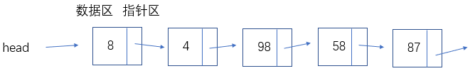
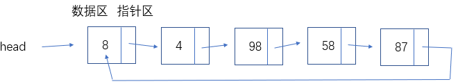

# 单向循环链表

单向链表



单向循环链表是其变形形式，需要把最后一个节点的指针指向头节点。



其功能与单向链表相同，下面用*Python*实现。

- 判断链表是否为空
- 得到链表的长度
- 遍历
- 头部添加节点
- 尾部添加节点
- 指定位置添加节点
- 删除节点
- 查找节点是否存在

### 创建节点类

与单链表相同

```
class Node(object):
    def __init__(self, elem):
        self.elem = elem
        self.next = None
```

### 判断链表是否为空

与单链表相同

```
class SingleCircleList(object):
    """单向循环链表"""
    def __init__(self):
        self.head = None

    def is_empty(self):
        return self.head is None
```

### 得到链表的长度

与单链表相同

```
    def length(self):
        if self.is_empty(): # 判断是否为空
            return 0
        cur = self.__head
        count = 1
        while cur.next != self.__head:
            cur = cur.next
            count += 1
        return count
```

### 遍历

与单链表相同

```
     def travel(self):
        if self.is_empty():  # 判断是否为空
            return "空列表"
        cur = self.__head
        while cur.next != self.__head:
            print(cur.elem, end=",")
            cur = cur.next
        print(cur.elem)
```

### 头部添加节点

```
    def add(self, data):
        # 头部添加节点
        node = Node(data)
        if self.is_empty():  # 空链表如何添加
            self.__head = node
            node.next = self.__head  #尾结点指向头部
        else:
            cur = self.__head
            while cur.next != self.__head:
                cur = cur.next
            cur.next = node
            node.next = self.__head
            self.__head = node   #尾结点指向头部
```

### 尾部添加节点

```
    def append(self, item):
        node = Node(item)
        if self.is_empty():  # 空链表如何添加
            self.__head = node  #尾节点指向头部
            node.next = self.__head
        else:
            cur = self.__head
            while cur.next != self.__head:
                cur = cur.next
            cur.next = node
            node.next = self.__head  #尾结点指向头部
```

### 指定位置添加节点

与单链表相同

```
    def insert(self, position, data):
        if position <= 0:
            self.add(data)
        elif position > self.length() - 1:
            self.append(data)
        else:
            node = Node(data)
            pre = self.__head
            count = 0
            while count < position - 1:
                count += 1
                pre = pre.next
            node.next = pre.next
            pre.next = node
```

### 删除节点

```
def remove(self, data):
    if self.is_empty():   # 判断是否为空
        return
    cur = self.__head
    pre = None
    if cur.elem == data: # 表示删除头节点
        while cur.next != self.__head: 
            cur = cur.next
        cur.next = self.__head.next # 让尾节点指向第二个节点
        self.__head = self.__head.next # 让头节点指向第二个节点
    else:
        while cur.next != self.__head: 
            pre = cur
            cur = cur.next
            if cur.elem == data:
                pre.next = cur.next
                #return  # 不加return删除重复数据
```

### 查找节点是否存在

与单链表相同

```
    def search(self, data):
        cur = self.__head
        while cur.next != self.__head:
            if cur.elem == data:
                return "find %d" % data
            else:
                cur = cur.next
        return "Not find"
```

# 循环链表功能汇总

```
class Node(object):
    def __init__(self, elem):
        self.elem = elem
        self.next = None


class SingleCircleList(object):
    """单向循环链表"""
    def __init__(self):
        self.__head = None

    def is_empty(self):
        return self.__head is None

    def length(self):
        if self.is_empty():
            return 0
        cur = self.__head
        count = 1
        while cur.next != self.__head:
            cur = cur.next
            count += 1
        return count

    def travel(self):
        if self.is_empty():
            return "空列表"
        cur = self.__head
        while cur.next != self.__head:
            print(cur.elem, end=",")
            cur = cur.next
        print(cur.elem)

    def add(self, data):
        # 头部添加节点
        node = Node(data)
        if self.is_empty():
            self.__head = node
            node.next = self.__head
        else:
            cur = self.__head
            while cur.next != self.__head:
                cur = cur.next
            cur.next = node
            node.next = self.__head
            self.__head = node

    def append(self, item):
        node = Node(item)
        if self.is_empty():
            self.__head = node
            node.next = self.__head
        else:
            cur = self.__head
            while cur.next != self.__head:
                cur = cur.next
            cur.next = node
            node.next = self.__head

    def insert(self, position, data):
        if position <= 0:
            self.add(data)
        elif position > self.length() - 1:
            self.append(data)
        else:
            node = Node(data)
            pre = self.__head
            count = 0
            while count < position - 1:
                count += 1
                pre = pre.next
            node.next = pre.next
            pre.next = node

    def remove(self, data):
        if self.is_empty():
            return
        cur = self.__head
        pre = None
        if cur.elem == data:
            while cur.next != self.__head:
                cur = cur.next
            cur.next = self.__head.next
            self.__head = self.__head.next
        else:
            while cur.next != self.__head:
                pre = cur
                cur = cur.next
                if cur.elem == data:
                    pre.next = cur.next
                    #return


    def search(self, data):
        cur = self.__head
        while cur.next != self.__head:
            if cur.elem == data:
                return "find %d" % data
            else:
                cur = cur.next
        return "Not find"


alist = SingleCircleList()
alist.add(2)
alist.add(8)
alist.add(9)
alist.append(777)
alist.add(4)
alist.add(777)
alist.add(0)
alist.insert(3, 5)
alist.remove(777)
print(alist.is_empty())
print(alist.length())
alist.travel()
print(alist.search(9))
print(alist.search(10))
```

**结果**

```
False
6
0,4,5,9,8,2
find 9
Not find
```

