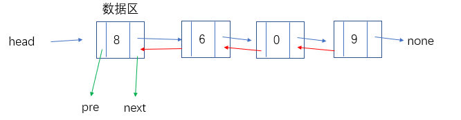

# 双向链表



双向链表是一种比较复杂的链表，这种链表稳定性特别高。每个节点又两个链接，一个指向前面的节点，一个指向后一个节点。

## 双向链表的功能

和单向链表、循环链表相同

-  判断链表是否为空
-  得到链表长度
-  遍历整个链表
-  头部添加元素
-  尾部添加元素
-  指定位置添加元素
-  删除节点
-  查找节点

# 用Python实现双向链表

### 创建节点类

```
class Node(object):
    """定义节点类"""
    def __init__(self, elem):
        self.elem = elem  #数据区
        self.pre = None  #头指针
        self.next = None  #尾指针
```

### 判断链表是否为空

与单链表相同

```
class DoubleList(object):
    """定义双向列表"""
    def __init__(self):
        self.__head = None

    def is_empty(self):
        """链表是否为空"""
        return self.__head is None
```

### 得到链表长度

```
def search(self, data):
    """查找元素"""
    try:
        cur = self.__head
        while cur.next is not None:
            if cur.elem == data:
                return "find sucess"
            cur = cur.next
        return "not found"
    except:
        return "not found"
```

```
    def length(self):
        """链表的长度"""
        if self.is_empty():
            return 0
        cur = self.__head
        count = 0
        while cur is not None:
            count += 1
            cur = cur.next
        return count
```

### 遍历链表

与单链表相同

```
    def travel(self):
        """遍历链表"""
        if self.is_empty():
            print('空链表')
            return
        cur = self.__head
        while cur is not None:
            print(cur.elem, end=",")
            cur = cur.next
        print()
```

### 头部添加元素

```
    def add(self, data):
        """头部添加元素"""
        node = Node(data)
        if self.is_empty(): # 空链表添加头部元素
            self.__head = node # 指向新节点
            node.pre = self.__head # 新节点指向头部
        else:
            node.next = self.__head  # 新节点指向第二个节点
            self.__head.pre = node # 第二个节点头部指向新节点
            self.__head = node # 头部指向新节点
            node.pre = self.__head  # 新节点指向头部
```

### 尾部添加元素

```
    def append(self, data):
        """尾部添加元素"""
        node = Node(data)
        if self.is_empty(): #空链表相当于头部添加
            self.__head = node
            node.pre = self.__head
        else:
            cur = self.__head
            while cur.next is not None:
                cur = cur.next
            cur.next = node
            node.pre = cur
```

### 指定位置添加元素

```
def insert(self, position, data):
    """指定位置插入元素"""
    if position <= 0:
        self.add(data)
    elif position > self.length() - 1:
        self.append(data)
    else:
        node = Node(data)
        cur = self.__head
        count = 0
        while count < position:
            count += 1
            cur = cur.next
        cur.pre.next = node
        node.pre = cur.pre
        node.next = cur
        cur.pre = node
```

### 删除节点

难点

```
    def remove(self, data):
        """删除元素"""
        if self.is_empty(): # 空链表返回错误
            return False
        cur = self.__head
        if cur.elem == data: #头部等于删除元素
            if cur.next is not None: # 判断如果只存在一个元素
                self.__head = None
            else: 
                cur.next.pre = self.__head
                self.__head = cur.next
        else:
            while cur.next is not None: 
                cur = cur.next
                if cur.elem == data:  # 删除元素不在链表尾部
                    cur.next.pre = cur.pre
                    cur.pre.next = cur.next
            if cur.elem == data: # 删除元素在链表尾部
                cur.pre.next = None
```

### 查找节点

与单链表相同

```
    def search(self, data):
        """查找元素"""
        try:
            cur = self.__head
            while cur.next is not None:
                if cur.elem == data:
                    return "find sucess"
                cur = cur.next
            return "not found"
        except:
            return "not found"
```

## 双向链表功能汇总

```
class Node(object):
    """定义节点类"""
    def __init__(self, elem):
        self.elem = elem
        self.pre = None
        self.next = None


class DoubleList(object):
    """定义双向列表"""
    def __init__(self):
        self.__head = None

    def is_empty(self):
        """链表是否为空"""
        return self.__head is None

    def length(self):
        """链表的长度"""
        if self.is_empty():
            return 0
        cur = self.__head
        count = 0
        while cur is not None:
            count += 1
            cur = cur.next
        return count

    def travel(self):
        """遍历链表"""
        if self.is_empty():
            print('空链表')
            return
        cur = self.__head
        while cur is not None:
            print(cur.elem, end=",")
            cur = cur.next
        print()

    def add(self, data):
        """头部添加元素"""
        node = Node(data)
        if self.is_empty():
            self.__head = node
            node.pre = self.__head
        else:
            node.next = self.__head
            self.__head.pre = node
            self.__head = node
            node.pre = self.__head

    def append(self, data):
        """尾部添加元素"""
        node = Node(data)
        if self.is_empty():
            self.__head = node
            node.pre = self.__head
        else:
            cur = self.__head
            while cur.next is not None:
                cur = cur.next
            cur.next = node
            node.pre = cur

    def insert(self, position, data):
        """指定位置插入元素"""
        if position <= 0:
            self.add(data)
        elif position > self.length() - 1:
            self.append(data)
        else:
            node = Node(data)
            cur = self.__head
            count = 0
            while count < position:
                count += 1
                cur = cur.next
            cur.pre.next = node
            node.pre = cur.pre
            node.next = cur
            cur.pre = node

    def remove(self, data):
        """删除元素"""
        if self.is_empty():
            return False
        cur = self.__head
        if cur.elem == data:
            if cur.next is not None:
                self.__head = None
            else:
                cur.next.pre = self.__head
                self.__head = cur.next
        else:
            while cur.next is not None:
                cur = cur.next
                if cur.elem == data:
                    cur.next.pre = cur.pre
                    cur.pre.next = cur.next
            if cur.elem == data:
                cur.pre.next = None

    def search(self, data):
        """查找元素"""
        try:
            cur = self.__head
            while cur.next is not None:
                if cur.elem == data:
                    return "find sucess"
                cur = cur.next
            return "not found"
        except:
            return "not found"


alist = DoubleList()
print(alist.is_empty())
print(alist.length())
alist.travel()
print("*"*10)
alist.add(3)
alist.add(0)
alist.append(77)
alist.insert(1, 99)
print(alist.is_empty())
print(alist.length())
alist.travel()
print("*"*10)
alist.remove(99)
print(alist.search(66))
print(alist.search(77))
alist.travel()
```

**结果**

```
True
0
空链表
**********
False
4
0,99,3,77,
**********
not found
not found
0,3,77,
```

