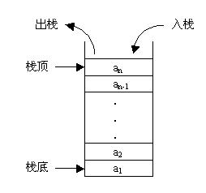

# 栈

已经学习了线性表里的顺序表和链表，下面的栈也是线性表。栈和队列相对应，队列也是线性表。



如上图，栈又称堆栈，限定仅在表尾进行插入和删除元素的线性表。向一个栈插入新元素称为进栈、入栈或压栈。它是把新元素放到栈顶元素的上面，使之成为新的栈顶元素；从一个栈删除元素又称作出栈或退栈，它是把栈顶元素删除掉，使其相邻的元素成为新的栈顶元素。

### 栈的操作

- 创建新的空栈
- 添加新的元素
- 弹出栈顶元素
- 返回栈顶元素
- 判断栈是否为空
- 返回栈的元素个数
- 遍历栈

## 实现思路

使用顺序表（列表）实现，和链表实现的不同点

**列表在尾部添加和删除元素的时间复杂度为O（1），在头部添加删除时间复杂度为O（n）**

**链表在尾部添加和删除元素的时间复杂度为O（n）,  在头部添加删除时间复杂度为O（1）**。

# 顺序表实现栈

### 创建新的空栈

```
class Stack(object):
    """创建栈"""
    def __init__(self):
        self.stack = []  # 初始化一个空列表，即空栈
```

### 添加新的元素

```
    def push(self, data):
        """入栈"""
        self.stack.append(data) # 列表的尾部添加方法
```

### 弹出栈顶元素

```
def pop(self):
    """出栈"""
    self.stack.pop()  # 列表的尾部删除方法
```

### 返回栈顶元素

```
def top_num(self):
    """返回栈顶元素"""
    return self.stack[len(self.stack) - 1]
```

### 判断栈是否为空

```
def is_empty(self):
    """判断是否为空"""
    return len(self.stack) == 0
```

### 返回栈的元素个数

```
def length(self):
    """栈的长度"""
    return len(self.stack)
```

### 遍历栈

```
def travel(self):
    """遍历栈"""
    return self.stack
```

# 栈功能汇总

```
class Stack(object):
    """创建栈"""
    def __init__(self):
        self.stack = []  # 初始化一个空列表，即空栈

    def is_empty(self):
        """判断是否为空"""
        return len(self.stack) == 0

    def length(self):
        """栈的长度"""
        return len(self.stack)

    def push(self, data):
        """入栈"""
        self.stack.append(data)

    def pop(self):
        """出栈"""
        self.stack.pop()

    def top_num(self):
        """返回栈顶元素"""
        return self.stack[len(self.stack) - 1]

    def travel(self):
        """遍历栈"""
        return self.stack


s = Stack()
print(s.is_empty())
print("*"*10)
s.push(8)
s.push(9)
s.push(2)
s.push(7)
print(s.is_empty())
print(s.length())
print(s.travel())
print(s.top_num())
print("*"*10)
s.pop()
s.pop()
print(s.length())
print(s.travel())
print(s.top_num())
```

**结果**

```
True
**********
False
4
[8, 9, 2, 7]
7
**********
2
[8, 9]
9
```

# 用链表实现栈

```
class Node(object):
    """节点类"""
    def __init__(self, elem):
        self.elem = elem  # 节点的数据
        self.next = None  # 节点的指针，默认为指向空


class SingeList(object):
    """单向列表的功能"""
    def __init__(self):
        self.__head = None

    def is_empty(self):
        # 判断链表是否为空
        # if self.head == None:
        #     return True
        # else:
        #     return False
        return self.__head is None

    def length(self):
        # 得到链表长度
        cur = self.__head  # 创建一个标记，指向头部
        count = 0  # 计数变量
        while cur is not None:  # 如果标记指向不是None
            cur = cur.next  # 让标记后移一个节点
            count += 1  # 并且计数加1
        return count  # 最后返回总计数

    def travel(self):
        # 遍历列表
        if self.is_empty():  # 遍历之前判断空列表
            print("空列表")
        else:
            cur = self.__head
            while cur is not None:
                print(cur.elem, end=",")
                cur = cur.next
            print()

    def add(self, data):
        # 头部添加元素
        node = Node(data)  # 创建节点
        node.next = self.__head  # 让新节点指向初始头部的指向
        self.__head = node  # 在让头部指向新节点

    def append(self, data):
        # 尾部添加元素
        node = Node(data)  # 创建新节点
        if self.is_empty():  # 如果是空列表
            # self.add(data)  #调用头部添加函数
            self.__head = node
        else:
            cur = self.__head
            while cur.next is not None:  # 判断标记的下一个节点是不是为None
                cur = cur.next  # 不是继续移动标记
            cur.next = node  # 是，让标记指针指向新节点

    def insert(self, position, data):
        # 指定位置插入
        if position <= 0:  # 如果指定位置小于等于0，调用头部出入函数
            self.add(data)
        elif position > (self.length()-1):  # 如果指定位置大于self.length()-1
            self.append(data)  # 调用尾部插入函数
        else:
            node = Node(data)  # 创建新节点
            pre = self.__head  # 创建当前节点的前一个节点
            count = 0
            while count < position - 1:
                pre = pre.next
                count += 1
            node.next = pre.next  # 新节点的指针指向pre指向的那个节点
            pre.next = node  # pre指针指向新节点

    def remove(self, data):
        # 删除节点
        cur = self.__head
        pre = None
        while cur is not None:
            if cur.elem == data:  # 如果当前节点数据和删除数据相等
                if pre is None:   # 如果pre == None，说明是第一个节点
                    self.__head = cur.next
                    return "已删除"
                else:
                    pre.next = cur.next
                    return "已删除"
            else:  # 继续移动标记
                pre = cur
                cur = cur.next

    def search(self, data):
        # 查找节点
        cur = self.__head
        while cur is not None:
            if cur.elem == data:  # 如果当前节点数据和查找数据相等
                print("找到数据")
                return
            cur = cur.next
        print("未找到%d" % data)
        
    def first_node(self):  # 需要调用私有属性
        return self.__head


class Stack(object):
    def __init__(self):
        """初始化空栈"""
        self.stack = SingeList()
        
    def is_empty(self):
        """判断是否为空"""
        return self.stack.is_empty() 
    
    def length(self):
        """栈的长度"""
        return self.stack.length()
    
    def push(self, data):
        """入栈"""
        self.stack.add(data)
        
    def pop(self, data):
        """出栈"""
        self.stack.remove(data)
        
    def top_num(self):
        """返回栈顶元素"""
        return self.stack.first_node()
    
    def travel(self):
        """遍历"""
        return self.stack.travel()
    
```