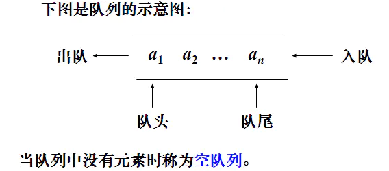
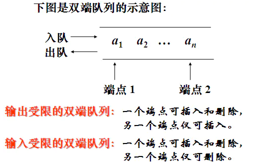

# 队列

队列是一种特殊的线性表，特殊之处在于它只允许在表的前端进行删除操作，而在表的后端（rear）进行插入操作，和栈一样，队列是一种操作受限制的线性表。进行插入操作的端称为队尾，进行删除操作的端称为队头。



**与栈的区别**

栈：先进后出**first in last out**，简称**FILO**

队列：先进先出**first in first out**，简称**FIFO**

# 对列功能

同栈一样，对列可以用顺序表和链表实现

- 创建一个空的队列
- 队列中添加一个元素
- 从队列头部删除一个元素
- 判断一个队列是否为空
- 返回队列长度
- 遍历

# 用顺序表实现

### 创建一个空的队列

```
class Queue(object):
    def __init__(self):
        """创建空队列"""
        self.queue = []
```

### 队列中添加一个元素

```
def append(self, data):
    """队列中添加一个元素"""
    self.queue.append(data)
```

### 从队列头部删除一个元素

```
def remove(self):
    """从队列头部删除一个元素"""
    self.queue.remove(self.queue[0])
```

### 判断一个队列是否为空

```
def is_empty(self):
    """判断一个队列是否为空"""
    return len(self.queue) == 0
```

### 返回队列长度

```
def length(self):
    """返回队列长度"""
    return len(self.queue)
```

### 返回队列长度

```
def travel(self):
    """遍历"""
    return self.queue
```

### 汇总

```
class Queue(object):
    def __init__(self):
        """创建空队列"""
        self.queue = []

    def append(self, data):
        """队列中添加一个元素"""
        self.queue.append(data)

    def remove(self):
        """从队列头部删除一个元素"""
        self.queue.remove(self.queue[0])

    def is_empty(self):
        """判断一个队列是否为空"""
        return len(self.queue) == 0

    def length(self):
        """返回队列长度"""
        return len(self.queue)

    def travel(self):
        """遍历"""
        return self.queue


q = Queue()
q.append(8)
q.append(9)
q.append(1)
q.append(2)
print(q.length())
print(q.travel())
q.remove()
q.remove()
print(q.length())
print(q.travel())
```

**结果**

```
4
[8, 9, 1, 2]
2
[1, 2]
```

# 用链表表实现

### 创建一个空的队列

```
class Queue(object):
    def __init__(self):
        """创建空队列"""
        self.queue = SingeList()
```

### 队列中添加一个元素

```
def append(self, data):
    """队列中添加一个元素"""
    self.queue.append(data)
```

### 从队列头部删除一个元素

```
def remove(self):
    """从队列头部删除一个元素"""
    data = self.queue.first_node().elem
    self.queue.remove(data)
```

### 判断一个队列是否为空

```
def is_empty(self):
    """判断一个队列是否为空"""
    return self.queue.is_empty()
```

### 返回队列长度

```
def length(self):
    """返回队列长度"""
    return self.queue.length()
```

### 遍历

```
def travel(self):
    """遍历"""
    return self.queue.travel()
```

### 汇总

和栈相同汇总方式

# 双端队列



### 操作

- Deque() 创建一个空的双端队列
- add_front(item) 从队头加入一个item元素
- add_rear(item) 从队尾加入一个item元素
- remove_front() 从队头删除一个item元素
- remove_rear() 从队尾删除一个item元素
- is_empty() 判断双端队列是否为空
- size() 返回队列的大小

## 顺序表实现

```
class Deque(object):
    def __init__(self):
        self.deque = []

    def add_front(self, data):
        """从队头加入元素"""
        self.deque.insert(0, data)

    def add_rear(self, data):
        """从队尾加入素"""
        self.deque.append(data)

    def remove_front(self):
        """从队头删除元素"""
        self.deque.pop(0)

    def remove_rear(self):
        """从队尾删除一个item元素"""
        self.deque.pop()

    def is_empty(self):
        """判断双端队列是否为空"""
        return len(self.deque) == 0

    def length(self):
        """长度"""
        return len(self.deque)

    def travel(self):
        """遍历"""
        return self.deque
```