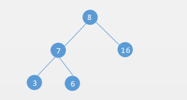

# 树

树是一种数据结构，是一种非线性数据结构。它是n个有限节点组成具有层次关系的集合，因为形状像一颗倒挂的树，因此把它叫做树。	


它具有以下的特点：

- 每个节点有零个或多个子节点；
- 没有父节点的节点称为根节点；
- 每一个非根节点有且只有一个父节点；
- 除了根节点外，每个子节点可以分为多个不相交的子树；

# 树的基本概念

|         | 术语     | 解释                                     |
| ------- | -------- | ---------------------------------------- |
| Root    | 根节点   | 树上最高位置的节点                       |
| Child   | 子节点   | 节点子树的根称为这个孩子的子节点         |
| Degree  | 度       | 所有结点当中，子树分支最最多的就是树的度 |
| Leaf    | 叶子节点 | 度为0的节点，也叫端节点                  |
| Parent  | 父节点   | 一个节点含有子节点称为其子节点的父节点   |
| Sibling | 兄弟节点 | 同一双亲的孩子                           |
| Level   | 层级     | 树的层次                                 |
| Depth   | 深度     | 树的最大层次                             |
| Forest  | 森林     | 互不相交的树的集合                       |

# 二叉树

**二叉树**：每个节点最多含有两个子树的树称为二叉树；左边的分支称之为左子树，右边的分支称之为右子树。也就是说，二叉树的度最大也就是2，而一般的树的度是没有限制的。



## 二叉树的分类

满二叉树（又叫完美二叉树）：一个二叉树，如果每一个层的结点数都达到最大值，则这个二叉树就是满二叉树。


完全二叉树：除了最后一层外，其他层都是满的。最后一层的节点要从左往右依次排列，如果最后一层满了，那就成了满二叉树。


#### 二叉树的性质

* 性质1：在二叉树的第*i*层上最多有$2^{i-1}$个节点，(i>0)
* 性质2：一颗二叉树深度为*i*最多有$2^i-1$个节点，(i>0)
* 性质3：对于任何一棵二叉树，如果其叶子结点的个数为K，度为2的结点数为M,则K=M+1
* 性质4：对完全二叉树，若从上至下、从左至右编号，则编号为i 的结点，其左孩子编号必为2i，其右孩子编号必为2i＋1；其双亲的编号必为i/2（i＝1 时为根,除外）

### 二叉树的存储方式

* 顺序存储：将数据结构存储在固定的数组中，然在遍历速度上有一定的优势，但因所占空间比较大。二叉树通常以链式存储。


* 链式存储：节点之间通过类似链表的链接方式来连接，每个父节点有一个左节点`lchild`一个右节点`rchild`。


### 二叉树节点创建

```
class Node(object):
    """创建二叉树的节点"""
    def __init__(self ,elem):
        self.elem = elem
        self.rchild = None  # 右节点指针
        self.lchild = None  # 左节点指针
```

### 二叉树增加节点

思考：怎么增加节点？

增加节点首先要确定增加节点的位置，从根节点开始寻找，如果根节点有左右两个孩子，就要找根节点的两个孩子中是否都存在两个节点。**用队列实现，寻找过程如下**


**代码实现**

```
def add(self, data):
    """增加二叉树节点"""
    node = Node(data)  # 创建新节点
    if self.root is None:  # 如果没有根节点
        self.root = node
        return 
    queue = [self.root]  # 创建队列，把根节点放入队列
    while queue:
        root = queue.pop(0)
        if root.lchild is None:  # 如果没有左节点
            root.lchild = node
            return 
        else:
            queue.append(root.lchild)  # 添加左节点到队列
        if root.rchild is None: # 如果没有右节点
            root.rchild = node
            return 
        else:
            queue.append(root.rchild)  # 添加右节点到队列
```

# 二叉树的遍历

二叉树怎么遍历？

>树的遍历是树的一种重要的运算。所谓遍历是指对树中所有结点的信息的访问，即依次对树中每个结点访问一次且仅访问一次，我们把这种对所有节点的访问称为遍历。那么树的两种重要的遍历模式是深度优先遍历和广度优先遍历,**深度优先一般用递归，广度优先一般用队列。一般情况下能用递归实现的算法大部分也能用堆栈来实现。**


二叉树的遍历分为：深度优先遍历和广度优先遍历

* 广度优先遍历（层次遍历）指从上到下依次遍历，结果为`1,2,3,4,5,6,7,8,9,10,11,12`
* 深度优先遍历分为：
    * 先序遍历：先遍历根部，在左右`8,4,9,2,10,5,11,1,12,6,3,7`
    * 中序遍历：先遍历左，再遍历根，最后右`8,4,2,1,9,10,5,11,12,6,3,7`
    * 后序遍历：先左右，后遍历根部`8,9,4,10,11,5,2,12,6,7,3,1`

## python实现广度遍历

```
def width_travel(self):
    """广度遍历：使用队列"""
    if self.root is None:
        print(self.root)
        return
    queue = [self.root]  # 创建队列，把根节点放入队列
    while queue:
        root = queue.pop(0)
        print(root.elem, end=",")
        if root.lchild is not None:
            queue.append(root.lchild)
        if root.rchild is not None:
            queue.append(root.rchild)
    print()
```

## 先序遍历

```
def preorder(self, root):
    """先序遍历：递归方法"""
    if root is None:  # 如果根是空就返回
        return
    print(root.elem, end=",") # 不是空，就打印根的数据
    self.preorder(root.lchild) # 根的左孩子递归调用本方法
    self.preorder(root.rchild) # 根的右孩子递归调用本方法
```

## 中序遍历

```
def inorder(self, root):
    """中序遍历：递归方法"""
    if root is None:  # 如果根是空就返回
        return
    self.inorder(root.lchild)  # 根的左孩子递归调用本方法
    print(root.elem, end=",")  # 不是空，就打印根的数据
    self.inorder(root.rchild)  # 根的右孩子递归调用本方法
```

## 后序遍历

```
def postorder(self, root):
    """后序遍历：递归方法"""
    if root is None:
        return
    self.postorder(root.lchild)
    self.postorder(root.rchild)
    print(root.elem, end=",")
```

# 二叉树功能汇总

```
class Node(object):
    """创建二叉树的节点"""
    def __init__(self, elem):
        self.elem = elem
        self.rchild = None
        self.lchild = None


class Tree(object):
    """创建二叉树"""
    def __init__(self):
        self.root = None

    def add(self, data):
        """增加二叉树节点"""
        node = Node(data)  # 创建新节点
        if self.root is None:
            self.root = node
            return
        queue = [self.root]  # 创建队列，把根节点放入队列
        while queue:
            root = queue.pop(0)
            if root.lchild is None:
                root.lchild = node
                return
            else:
                queue.append(root.lchild)
            if root.rchild is None:
                root.rchild = node
                return
            else:
                queue.append(root.rchild)

    def width_travel(self):
        """广度遍历：使用队列"""
        if self.root is None:
            print(self.root)
            return
        queue = [self.root]  # 创建队列，把根节点放入队列
        while queue:
            root = queue.pop(0)
            print(root.elem, end=",")
            if root.lchild is not None:
                queue.append(root.lchild)
            if root.rchild is not None:
                queue.append(root.rchild)
        print()

    def preorder(self, root):
        """先序遍历：递归方法"""
        if root is None:
            return
        print(root.elem, end=",")
        self.preorder(root.lchild)
        self.preorder(root.rchild)

    def inorder(self, root):
        """中序遍历：递归方法"""
        if root is None:
            return
        self.inorder(root.lchild)
        print(root.elem, end=",")
        self.inorder(root.rchild)

    def postorder(self, root):
        """后序遍历：递归方法"""
        if root is None:
            return
        self.postorder(root.lchild)
        self.postorder(root.rchild)
        print(root.elem, end=",")


t = Tree()
t.add(1)
t.add(2)
t.add(3)
t.add(4)
t.add(5)
t.add(6)
t.add(7)
t.add(8)
t.add(9)
t.add(10)
t.add(11)
t.add(12)
t.width_travel()
t.preorder(t.root)
print()
t.inorder(t.root)
print()
t.postorder(t.root)
```

**结果**

```
1,2,3,4,5,6,7,8,9,10,11,12,  广度优先遍历
1,2,4,8,9,5,10,11,3,6,12,7,  先序遍历
8,4,9,2,10,5,11,1,12,6,3,7,  中序遍历
8,9,4,10,11,5,2,12,6,7,3,1,  后序遍历
```

**与上面的对比**

* 广度优先遍历：`1,2,3,4,5,6,7,8,9,10,11,12`
* 先序遍历：先遍历根部，在左右`1,2,4,8,9,5,10,11,3,6,12,7`
* 中序遍历：先遍历左，再遍历根，最后右`8,4,9,2,10,5,11,1,12,6,3,7`
* 后序遍历：先左右，后遍历根部`8,9,4,10,11,5,2,12,6,7,3,1`

