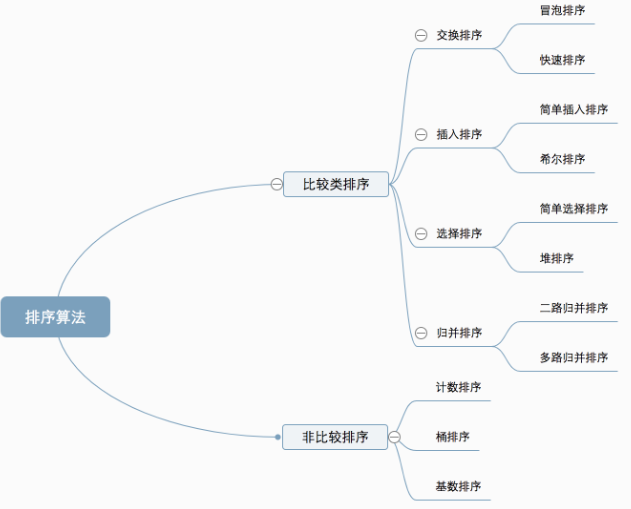
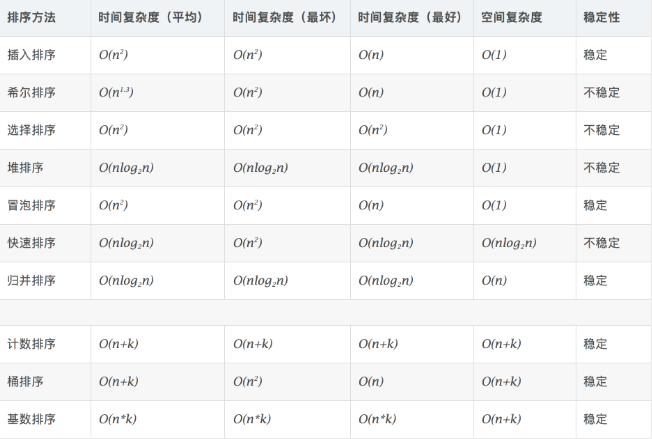
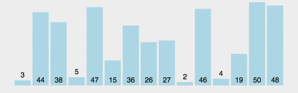
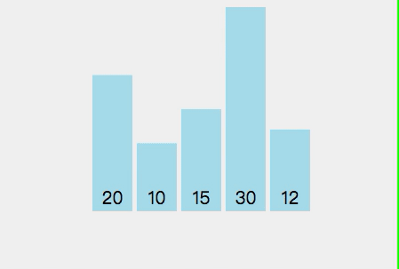
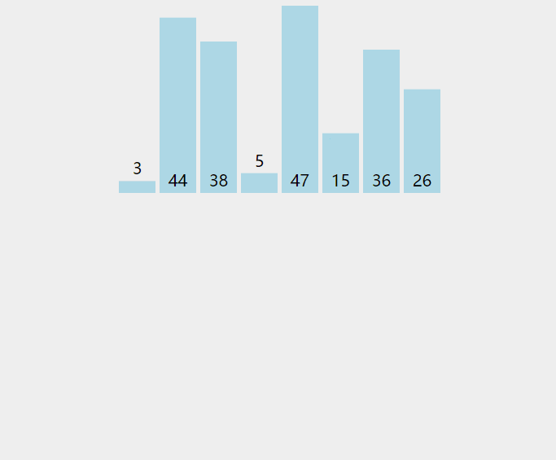
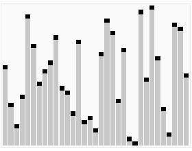
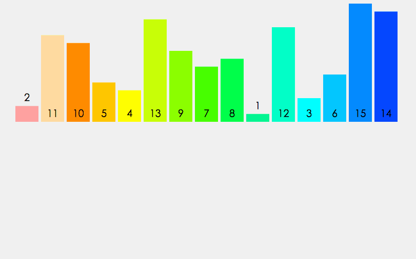

# 常见排序算法

为什么需要排序算法？

混乱无序的数据是没有价值的，数据排序是为了更好、更快的利用数据。试想一下，手机中的电话簿为什么要按从A到Z排列？为了更快的找到目标联系人。数据排序也是一样，数据排序是数据查找前的重要准备环节。

**常见的排序算法可以分为两大类**

* 比较排序：通过比较来决定元素之间的相对次序。
* 非比较排序：不通过比较来决定元素间的相对次序。



**时间复杂度比较**



**相关术语**

什么是稳定排序、原地排序？

* 稳定排序：如果 a 原本在 b 的前面，且 a == b，排序之后 a 仍然在 b 的前面，则为稳定排序。

* 非稳定排序：如果 a 原本在 b 的前面，且 a == b，排序之后 a 可能不在 b 的前面，则为非稳定排序。

* 原地排序：原地排序就是指在排序过程中不申请多余的存储空间，只利用原来存储待排数据的存储空间进行比较和交换的数据排序。

* 非原地排序：需要利用额外的数组来辅助排序。

## 冒泡排序

冒泡排序是一种简单的排序算法，它重复比较相邻的两个元素的大小，如果顺序错误就颠倒一下位置，直到没有数据交换，表示排序完成。稳定排序。

**动图演示**



**代码实现**

```
def bubbleSort(alist):
    """冒泡排序"""
    length = len(alist)   # 列表的长度
    for i in range(length - 1):  # 走访列表 length -1 次
        for j in range(length - 1 - i):  # 每次走访列表比较 length-1-i次
            if alist[j] > alist[j + 1]:  # 如果后面小，就和前面元素交换位置
                alist[j], alist[j+1] = alist[j+1], alist[j]

blist = [1,5,3,67,567,8,76,0,3,54,65,2,43,654,23,44]
bubleSort(blist)
```

**算法分析**

* 最优时间复杂度为O(n)，即列表刚好正序，一趟遍历即可完成排序，比较次数为$n-1$，时间复杂度为O(n)。
* 最坏时间复杂度O($n^2$)，即列表刚好反序，最少$n-1$趟排序，每趟需要比较$n-i$次($1\leq{i}\leq{n-1}$)，时间复杂度为O($n^2$)。
* 冒泡排序总的平均时间复杂度为O($n^2$)。

## 选择排序

选择排序是一种简单直观的排序算法。大概原理就是从出列中选出一个最大值（或者最小值）放在列表的最后一个位置（或者第一个位置），然后对剩下的列表元素继续选择最大值（或者最小值），直到排序完成。不稳定排序。



**代码实现**

```
def selectSort(alist):
    """选择排序"""
    length = len(alist)
    for i in range(length - 1):  # 对列表进行n-1趟遍历
        mix = i                  # 记录最小值的下标，第一次默认为i 
        for j in range(i, length):  # 开始比较
            if alist[mix] > alist[j]:  # 如果比最小值小
                mix = j                # 记录下标
        alist[i], alist[mix] = alist[mix], alist[i]  # 与最头部交换数据

blist = [1,5,3,67,567,8,76,0,3,54,65,2,43,654,23,44]
selectSort(blist)
```

**算法分析**

表现最稳定的排序算法之一，也是一般正常生活中常用的。最好、最坏、平均时间复杂度都是O($n^2 $)，空间复杂度为O(1)，即不占用额外内存空间。

## 插入排序

插入排序是一种简单直观并且稳定的排序算法。将数据插入到前面排好的序列中，并且保证序列正序，直到所有数据插完。



**代码实现**

```
def insertSort(alist):
    """插入排序"""
    length = len(alist)
    for i in range(1, length):  # 从第二个元素开始遍历
        for j in range(i, 0, -1):  # 第i个元素向前比较
            if alist[j] < alist[j-1]:  如果j比j-1小，交换位置
                alist[j], alist[j-1] = alist[j-1], alist[j]

blist = [1,5,3,67,567,8,76,0,3,54,65,2,43,654,23,44]
insertSort(blist)
```

**算法分析**

插入排序采用原地排序，并不消耗额外的空间，所以空间复杂度为O(1)。最好时间复杂度为O(n)，刚好为正序，最坏时间复杂度为O($ n^2 $)。

## 希尔排序 -- 插入排序改进版

希尔排序又叫缩小增量排序。和插入排序不同的是，会优先比较距离较远的元素。非稳定排序。


**代码实现**

```
def shellSort(alist):
    """希尔排序"""
    length = len(alist) 
    step = length // 2  # 步长取半
    while step > 0: # 步长等于1且执行完后会停止
        for i in range(step, length): # 遍历分组
            j = i
            while j > 0:
                if alist[j] < alist[j - step]:  # 对分组元素排序
                    alist[j], alist[j - step] = alist[j - step], alist[j]
                j -= step
        step //= 2   # 步长减半
    print(alist)

blist = [1,5,3,67,567,8,76,0,3,54,65,2,43,654,23,44]
shellSort(blist)
```

**算法分析**

* 最优时间复杂度根据步长判断
* 最坏时间复杂度，步长=1，此时为插入算法，为O($ n^2$)

## 快速排序

快速排序是对冒泡排序的改进，基本思想是：选出一个基准，按照基准将数据分成两个部分，一部分都比基准小，另一部分都比基准大，然后在按这种方法对两个部分排序，直到全部正序。



**代码实现——递归函数法**

```
def quick_sort(alist):
    """快速排序"""
    if len(alist) < 2:  # 递归函数终止条件
        return alist
    base = alist[0]  # 取列表中第一个元素为急诊
    less = []  # 创建一个小于基准的空列表
    greater = []  # 创建一个大于基准的空列表
    for i in alist[1:]:  # 遍历列表
        if i < base:  # 小于基准，添加到less
            less.append(i)
        else: # 大于基准，添加到greater
            greater.append(i)
    return quick_sort(less) + [base] + quick_sort(greater) # 返回列表


blist = [1, 5, 3, 67, 567, 8, 76, 0, 3, 54, 65, 2, 43, 654, 23, 44]
print(quick_sort(blist))
```

第二种

```text
def quickSort(arr,i,j):#快速排序总函数
    if i<j:
        base=uickSortProcess(arr,i,j)
        quickSort(arr,i,base)
        quickSort(arr,base+1,j)
        
def quickSortProcess(arr,i,j):#快排排序过程
    base=arr[i]
    while i<j:
        while i<j and arr[j]>=base:
            j-=1
        while i<j and arr[j]<base:
            arr[i]=arr[j]
            i+=1
            arr[j]=arr[i]
        arr[i]=base
    return i
```

**算法分析**

在快速排序中，最优时间复杂度为O($nlogn$)，最坏时间复杂度为O($ n^2$)，空间复杂度为O($nlogn$)，不稳定排序。

在排序中，需要$logn$次递归调用树，每次需要处理n个数据，空间复杂度为O($nlogn$)。

## 归并排序

归并排序是采用分治法的一个典型的应用，现将主序列划分为一个个子序列，子序列继续划分直到序列长度为0，然后向上合并子序列的母序列，直到排序结束。



**代码实现**

```python
def merge_sort(alist):
    if len(alist) <= 1:
        return alist
    # 二分分解
    num = len(alist)//2
    left = merge_sort(alist[:num])
    right = merge_sort(alist[num:])
    # 合并
    return merge(left,right)

def merge(left, right):
    #left与right的下标指针
    l, r = 0, 0
    result = []
    while l<len(left) and r<len(right):
        if left[l] < right[r]:
            result.append(left[l])
            l += 1
        else:
            result.append(right[r])
            r += 1
    result += left[l:]
    result += right[r:]
    return result

blist = [1, 5, 3, 67, 567, 8, 76, 0, 3, 54, 65, 2, 43, 654, 23, 44]
print(merge_sort(blist))
```