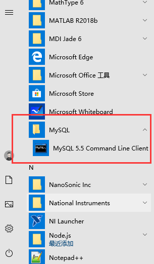

# 数据库 —— 电子化的文件柜

数据库（*database,简称DB*）是按照数据结构来组织、存储和管理数据的仓库。是一个长期存储在计算机内的、有组织的、可共享的、统一管理的大量数据的集合。

**数据库很重要**，它是专门用来管理数据的。例如下面我们访问百度。

我们知道，服务器其实就是*Linux*系统的电脑，它的内存很小，真正的大公司数据都是放在数据库中，可以存放海量数据并进行统一数据管理。

数据库同*Linux*一样，可以多用户共享、多用户共同操作。存储电子文件的地方，用户对文件的数据进行增、删、改、查等。

> 数据库是一个按照数据结构来存储和管理数据的计算机软件系统。数据库的概念有两层意思：
>
> 1. 数据库是一个实体，它是能够合理保存数据的仓库，用户在该仓库中存放要管理的数据，“数据”和“库”构成了数据库。
> 2. 数据库是数据管理的新方法和技术，它能更合适的组织数据、维护数据和利用数据。

# 数据库管理系统和SQL

如果你是一名老师，你有一个文件柜，你会怎么存储、处理学生信息？

数据库管理系统（*Database Management System*）是一种操纵和管理数据库的大型软件，用于维护、简历和使用数据库，简称**DBMS**，例如：图中的老师。**SQL**：例如上面老师手中的工具。

**数据库管理系统是使用SQL来管理使用数据库的，什么是SQL呢？**

**SQL**：是结构化查询语言（*Structured Query Language*），是一种专门用来管理数据库的编程语言。用于数据库的存储数据、查询、更新和管理数据。

> 结构化查询语言是高级的非过程化编程语言，允许用户在高层数据结构上工作。它不要求用户指定对数据的存放方法，也不需要用户了解具体的数据存放方式，所以具有完全不同底层结构的不同数据库系统, 可以使用相同的结构化查询语言作为数据输入与管理的接口。结构化查询语言语句可以嵌套，这使它具有极大的灵活性和强大的功能。 ------- 来自百度百科，不看也行。

# 常用的数据库管理系统

**[常见的数据库管理系统排名如下](https://db-engines.com/en/ranking)**

mysql是全世界用的最多的一种关系型数据库管理系统，全世界占有范围接近50%。

mysql是使用做多的，但不是最好的数据库管理系统，mysql有自身的不足之处。但是mysql是一种免费的数据库系统，对于大多数公司，mysql提供的功能完全够用，由于其体积小、速度快、总体拥有成本低，尤其是开放源码这特点，一般中小型网站的开发都选择MySQL作为网站数据库。

#### 安装教程

1. 链接：https://pan.baidu.com/s/10_roL8m0xfysa8NL5Qc3xw  提取码：`9ni9 `

2. 双击打开下载的MySQL安装包，下一步，下面只给出重要装步骤。

    

3. 点击Typical安装

    

4. 安装过程会自动弹出配置界面

    

5. 

    

    

    

6. 这一步注意

    

7. 

8. 

9. 安装完成。

10. 配置环境变量，默认安装在`C:\Program Files (x86)\MySQL\MySQL Server 5.5\bin`

11. 打开系统属性——环境变量

    

12. 找到path，双击path值

    

13. 新建路径，复制默认路径，上移后，确定，完成。

    

14. 验证登录，多种方式
    
    * 通过快捷方式
    
        
    
    * 打开Windows控制台`cmd`
    
        登录输入`mysql -h主机名 -u用户名  -p`  退出输入  `exit`
    
        也可以`mysql -uroot -p`
    
        

**MongoDB, Redis这两种数据库管理系统会在mysql更新完毕后，更新**