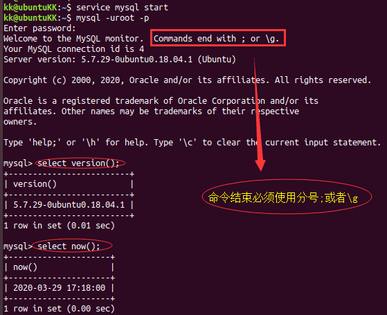
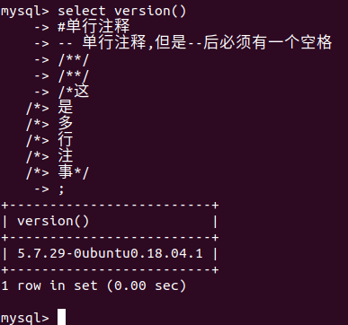
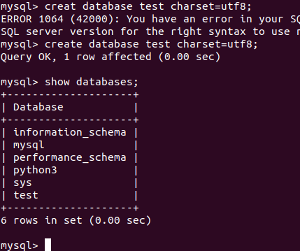
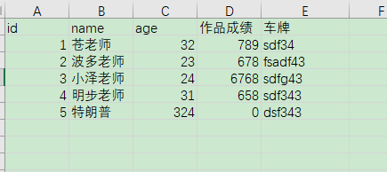

# MySQL常用命令

本节在*Ubuntu* 中介绍，*Windows*命令相同

### 安装

*Ubuntu*中安装MySQL比在*Windows*里简单的多的多。只需要在终端里执行：

```
sudo apt-get install mysql-server mysql-client
然后按照提示输入
```

### 管理服务

启动*MySQL*

```
service mysql start
```

停止*MySQL*

```
service mysql stop
```

重启*MySQL*

```
service mysql restart
```

### 开启远程连接

```
sudo vi /etc/mysql/mysql.conf.d/mysqld.cnf
将bind-address=127.0.0.1注释
```

登录进mysql

```
mysql -uroot -p
```

运行下面命令

```
grant all privileges on *.* to 'root'@'%' identified by 'mysql' with grant option;
flush privileges;
```

重启，搞定

### 登录MySQL

三种方式

```
mysql -h 主机名 -u root -p
myaql -uroot -p
mysql -hip 连接ip地址 -uroot -p  ----- 用于远程连接
```

### 退出MySQL

```
exit
quit
ctrl + c 
```

### 查看MySQL版本

```
查看版本：select version();
查看时间：select now();
```



### MySQL语法规范

1. 不区分大小写，但建议关键字大写，表名、列名小写；

2. 命令最好用英文`;`结尾；

3. 命令可以缩进或者换行；

4. 单行注释：`#哈哈`

    单行注释：`--哈哈`

    多行注释：`/*哈哈*/`

    

### 数据库基本操作

创建数据库

```
creat database 数据库名字 chartset=utf8;  #指定数据库的字符集，不指定默认utf8
```

查看所有数据库

```
show databases;
```

删除数据库

```
drop database 数据库名字;
```

切换数据库

```
use 数据库名字;
```

查看当前正在使用的数据库

```
select database();
```



### 数据库中表的操作

什么是表?

表是数据库中记录数据的文件，例如Excel中的表格一样记录数据方便查找修改。



**数据库存储数据的特点**就是将数据放在表中，在不表放到数据中。

* 一个数据可以有很多个表，每个表都要有一个唯一标识，来标示自己。表名具有唯一性。
* 表有一些特性，来表示表中的数据如何存储
    * 数字：int,decimal
    * 字符串：varchar,text
    * 日期：datetime
    * 布尔：bit
* 表是由列组成的，我们称为字段，一列即是一个字段。
* 表中的数据是按行存储的
* 表的字段有一些约束条件
    * 主键primary key：比如将上图`id`作为主键，新数据都会有一个唯一的id标识。
    * 非空not null：表示本字段（本列）内容不能为空
    * 惟一unique：保证本字段（本列）数据不能相互重复
    * 默认default：如果本字段不填内容，用默认值
    * 外键foreign key：表格相互链接时使用
    * 自动增长auto_increment: 如果`id`使用了自动增长，数据会逐渐增加1

**表操作**

查看当前数据所有表

```
show tables;
```

创建表

```
create table 表名(列和列的类型);
比如：
create table yellow_bool (
     id int primary key auto_increment not null,
     name varchar(10) not null,
     age int not null,
     isdelete bit default 0);
```

修改表

```
alter table 表名 add|change|drop 列名 类型;
比如：
alter table yello_book add birthday datetime;
```

删除表

```
drop table 表名
```

查看表结构

```
desc 表名;
```

更改表名

```
rename table 原表名 to 新表名;
```

查看创建表的语句

```
show create table 表名
```

### 数据的操作

查询

```
select * from 表名
```

增加

```
全列插入：insert into 表名 values()
缺省插入: insert into 表名(列1) values(值1)
同时插入多条：insert into 表名 values(),(),()
			insert into 表名(列1) values(值1),(值1)
```

**NOTE**：主键是自动增长，全列插入时填0，插入后会变成实际数值。

修改

```
update 表名 set 列1=值1，列2=值2，... where 条件
```

删除

```
delete from 表名 where 条件
```

逻辑删除（不是真正的删除，只是增加一个属性）

*对于重要的数据不能直接删除*

```
可以增加isdelete列，默认为0
删除哪一行，就给它增加1
只要查询isdelete=0,就是没有删除的列。
```


