# HTML基本结构

HTML是 HyperText Mark-up Language 的首字母简写，意思是超文本标记语言，超文本指的是超链接，标记指的是标签，是一种用来制作网页的语言，这种语言由一个个的标签组成，用这种语言制作的文件保存的是一个文本文件，文件的扩展名为html或者htm，一个html文件就是一个网页，html文件用编辑器打开显示的是文本，可以用文本的方式编辑它，如果用浏览器打开，浏览器会按照标签描述内容将文件渲染成网页，显示的网页可以从一个网页链接跳转到另外一个网页。

一个网页的基本结构如下：

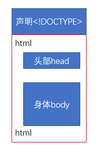

```
<!DOCTYPE html>
<html lang="en">
    <head>            
        <meta charset="UTF-8">
        <title>网页标题</title>
    </head>
    <body>
          网页显示内容
    </body>
</html>
```

第一行是文档声明，告诉浏览器这个页面是HTML页面，不同的版本的html页面的声明头部不一样。比如`xhtml 1.0`版本的头部为`<!DOCTYPE html PUBLIC "-//W3C//DTD XHTML 1.0 Transitional//EN" "http://www.w3.org/TR/xhtml1/DTD/xhtml1-transitional.dtd">`。`html 5`的头部声明为`<!DOCTYPE html>`。

第二行`<html lang="en">`与最后一行`</html>`相互呼应为一个整体。

html里包括的是其他标签，都有各自的含义，html标签可以相互嵌套。

### html文档规范

* 所有标签必须小写
* 所有属性必须用双引号括起来
* 所有标签必须闭合
    * 成对标签，例如`<body>....</body>     <div>...</div>`
    * 单个标签，如`<br /> `，只有一个标签，需要在后面加反斜杠
* img必须要加alt属性(对图片的描述)

### html注释

注释是对文档的解释说明，html中的注释格式如下：

```
<!-- This is 注释 -->
```

# HTML语法

### html文档

在html文档中，`<html>..</html>`包括了整个页面内的所有标签，告诉浏览器器这是一个html文档，是所有元素的容器。`<html>..</html>`中有一个属性`lang=""`，是langues的简写，告诉网页语言的格式。

```
<html lang="en">  # 网页为英文格式
<html>

<html lang="zh-CN">  # 网页为中文格式
<html>
```

例如谷歌浏览器，当打开网页显示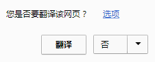

说明网页为英文格式。不显示，检查桌面源代码时，会发现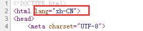

### html头部head

`<head></head>`是所有头部元素的容器，下面是能出现在头部的元素信息：

* `<title></title>`这个元素是必要的，表示网页的标题

* `<style></style>`，CSS样式美化html页面使用标签，后面会说。
* `<base>`页面相对基准URL
* `<meta>`页面信息标签
* `<link>`链接外部文件标签
* `<script>`脚本文件链接标签

### meta标签

描述页面的元数据，并不会显示在页面上，但是会被浏览器解析。因为是对网页的描述，所以通常会被浏览器、搜索引擎、或者一些爬虫调用。

**实例**

* 定义页面字符集

    ```
    <meta charset="UTF-8">
    ```

* 定义文档关键词，可以用于搜索引擎。只要百度中搜下面关键词，都能找到京东。

    ```
    <meta name="keywords" content="网上购物,网上商城,手机,笔记本,电脑,MP3,CD,VCD,DV,相机,数码,配件,手表,存储卡,京东">
    ```

* 定义web页面描述，例如京东。

    ```
    <meta name="description" content="京东JD.COM-专业的综合网上购物商城,销售家电、数码通讯、电脑、家居百货、服装服饰、母婴、图书、食品等数万个品牌优质商品.便捷、诚信的服务，为您提供愉悦的网上购物体验!"/>
    ```

    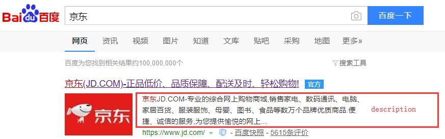

* 定义页面作者

    ```
    <meta name="author" content="kkxi22">
    ```

* 每30秒刷新页面

    ```
    <meta http-equiv="reflesh" content="30">
    ```

* 还可以用于移动端页面大小优化，移动端在讲。

### html身体body

页面中的html内容一般都在`<body></body>`里，在html4中，body有很多属性，到了html5中，已经删除所有body的属性了。

### html字体效果标签

1. 标题

    ```
    <body>
        <h1>这是标题一</h1>
        <h2>这是标题二</h2>
        <h3>这是标题三</h3>
        <h4>这是标题四</h4>
        <h5>这是标题五</h5>
        <h6>这是标题六</h6>
    </body>
    ```

    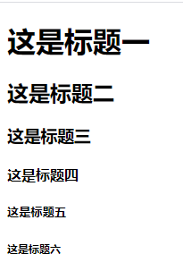

2. 文字语义化标签

    ```
    <body>
        <p>普通字体</p>                       # 段落标签
        <b>这是粗体字</b>
        <br />                              # 换行标签 
        <strong>粗体字，表示强调</strong>
        <br />
        <i>这是斜体字</i>
        <br />
        <em>这是斜体字，表示强调</em>
        <br />
        <dfn>斜体字，表示定义</dfn>
    </body>
    ```

    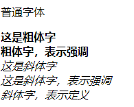

3. 文字标记标签

    ```
    <body>
        <u>u添加文字下划线</u><br />
        <ins>ins下划线，表示插入文字</ins><br />
        <strike>strike文字横线，html5已经删除此标签</strike><br />
        <s>s这是删除线</s><br />
        <del>del这也是删除线</del><br />
    </body>
    ```

    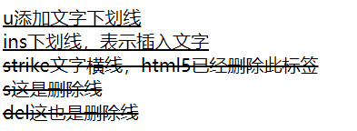

### html字符实体

在HTML中，如果代码中多个换行和空格，会被渲染成一个换行和空格。但是可以用字符实体解决。

`&nbsp;`表示空格

`<br />`表示换行

`&lt;`表示<

`&gt;`表示>

```
<body>
    <p>
             酷热的夏天刚刚过去，秋风吹来，
        秋牵着一个个节气的手，舞动着长袖，
        用婀娜多姿的舞姿，用变幻神奇的旋律，
        动听的音符，把蓝天吹得一会白云飘飘，
        一会云蒸霞蔚，一会仙女舞袖，一会又涌来千顷碧波。
    </p>
    <p>
        &nbsp;&nbsp;&nbsp;&nbsp;酷热的夏天刚刚过去，秋风吹来，<br />
        秋牵着一个个节气的手，舞动着长袖，<br />
        用婀娜多姿的舞姿，用变幻神奇的旋律，<br /><br /><br />
        动听的音符，把蓝天吹得一会白云飘飘，<br />
        一会云蒸霞蔚，一会仙女舞袖，一会又涌来千顷碧波。
    </p>
```

**结果**

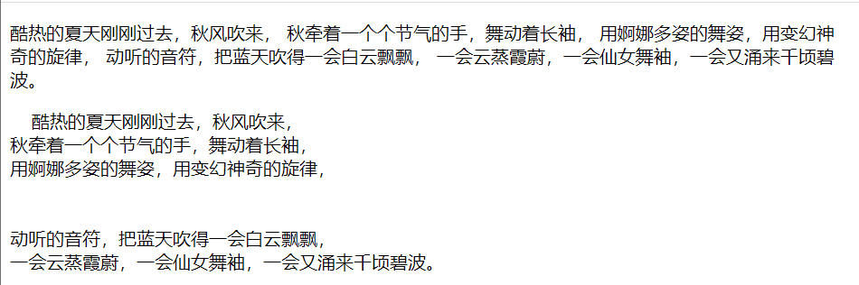

### HTML块元素

* `<div></div>`标签，表示一块内容，没有含义
* `<span></span>`标签表示行内块，没有含义

### 什么是语义化标签

语义化变迁代表一定含义，比如比如：h1标签是表示标题，p标签是表示段落，ul、li标签是表示列表，a标签表示链接，dl、dt、dd表示定义列表等。

多使用语义化标签的好处：在于浏览器能够识别语义化标签，并进行相应的处理。

### html图像

`img`标签可以在html页面上插入图像，有两个必须的属性：`scr`和`alt`

src代表了图像链接地址，alt代表了图像替代文本。

```
<body>
    
</body>
```


如果图片链接地址src错误，会显示alt文本内容，结果如下图：

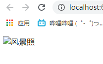

**NOTE**：`scr`链接地址可以使用相对路径和绝对路径。

### html链接

`<a>`标签可以在网页上定义一个链接地址，通过`href`属性跳转到目标位置，`title`属性定义鼠标悬停时弹出的文字提示框。

```
<body>
    <a href="http://www.baidu.com" title="点这里会跳转到百度">百度链接</a>
</body>
```


```
<a href="#">跳转到页面顶部</a>
<a href="javascript:void(0);">不跳转</a>
<a href="javascript:">不跳转</a>
```

### html列表

```
<body>
    <h3>有序列表</h3>
    <ol>
        <li>dffs</li>
        <li>asgd</li>
        <li>sadg</li>
    </ol>
    <h3>无序列表</h3>
    <ul>
        <li>dfg</li>
        <li>sdh</li>
        <li>dsfn</li>
    </ul>
    <h3>自定义列表</h3>
    <dl>
        <dt>html</dt>
        <dd>负责页面的结构</dd>
        <dt>css</dt>
        <dd>负责页面的表现</dd>
        <dt>javascript</dt>
        <dd>负责页面的行为</dd>
    </dl>
</body>
```

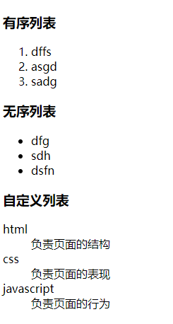

### html表格

表格常用标签

| table | 定义表格           |
| ----- | ------------------ |
| tr    | 定义表格中的一行   |
| td    | 定义普通单元格     |
| th    | 定义表格头部单元格 |

```
<body>
    <table border="1px">
        <tr>
            <th>学号</th>
            <th>姓名</th>
        </tr>
        <tr>
            <td>3245</td>
            <td>tom</td>
        </tr>
        <tr>
            <td>3246</td>
            <td>jerry</td>
        </tr>
    </table>
</body>
```

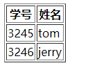

表格常用属性，决定表格的外观

| border          | 定义表格的边框                 |
| --------------- | ------------------------------ |
| cellpadding     | 定义单元格内内容与边框的距离   |
| cellspacing     | 定义单元格与单元格之间的距离   |
| align           | 设置单元格中内容的水平对齐方式 |
| valign          | 设置单元格中内容的垂直对齐方式 |
| colspan         | 设置单元格水平合并             |
| rowspan         | 设置单元格垂直合并             |
| border-collapse | 设置边框合并（collapse）       |

传统网页布局使用table，采用表格嵌套表格的方式。

### html表单

html中表单用来收集用户输入信息，比如账号、密码、邮箱、文本信息等。使用表单时首先使用`<form></form>`标签定义一个表单的整体区域，然后在这个区域中使用不同的表单控件，实现用户信息收集。

表单元素语法格式

```
<input  type="类型" name="元素名称" value="值"/>
```

| 属性      | 说明                                                         |
| --------- | ------------------------------------------------------------ |
| type      | 指定元素的类型。text、password、checkbox、radio、submit、reset、file、hidden、image 和 button，默认为 text |
| name      | 指定表单元素的名称                                           |
| value     | 元素的初始值。type 为 radio时必须指定一个值                  |
| size      | 指定表单元素的初始宽度。当 type 为 text 或 password时，表单元素的大小以字符为单位。对于其他类型，宽度以像素为单位 |
| maxlength | type为text 或 password 时，输入的最大字符数                  |
| checked   | type为radio或checkbox时，指定按钮是否是被选中                |

示例

1. form

    ```
        <form action="http://www...." method="post"></form>
    ```

    `action`表示向某个地址提交信息

    `method`表示用`post`方式提交信息，还有一种`get`提交方式，`post`安全性高，常用。

2. text类型
  ```
    <input type="text" name="文本类型" value="默认为邮箱">
  ```
3.possword类型
 ```
    <input type="password" value="">
 ```
4. radio类型

```
<input type="radio" value="男" name="单选" checked>男
<input type="radio" value="女" name="单选">女
```

5. checkbox类型

```
<input type="checkbox" name="水果" value="苹果">苹果
<input type="checkbox" name="水果" value="荔枝">荔枝
<input type="checkbox" name="水果" value="香蕉">香蕉
<input type="checkbox" name="水果" value="芒果">芒果
```

6. 列表框

```
<select name="地位" >
    <option value="" selected="selected">不如狗</option>
    <option value="">不如猫</option>
    <option value="">不如孩子</option>
    <option value="">不如老婆</option>
</select>
```

7. file类型

```
<input type="file">
```

8. 多行文本类型

```
<textarea name="message"></textarea>
```

9. submit类型和reset类型

```
<input type="submit">提交
<input type="reset">重置（所有输入数据）
```

**效果如下**

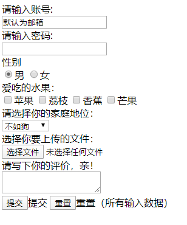

### html内嵌框架

标签`<iframe></iframe>`，会创建个包含另一个页面的内嵌框架，用`src`链接另一个页面地址，`frameborder`属性定义边框，`scrolling`属性定义是否有滚动条。

**示例**

```
<iframe src="http://www.baidu.com" frameborder="1px"></iframe>
```

通常配合a标签使用

```
<a href="http://www.baidu.com" target="myframe">百度页面</a>
<a href="http://taobao.com" target="myframe">淘宝页面</a>
<br />
<iframe src="http://www.baidu.com" width="1000px" height="500px" frameborder="1px" name="myframe"></iframe>
```

**效果如下**

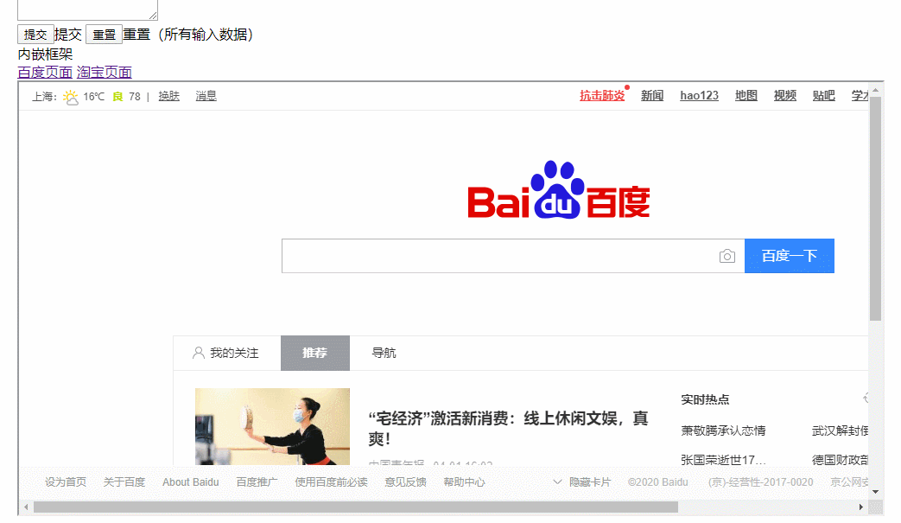

### 作业

使用传统表格布局制作下面的简历

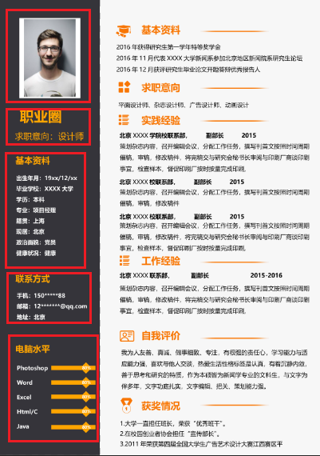

1. 将整个页面分为两部分，为表格的两列
2. 将右半部分分为五个部分，为右表格的五行
3. 将每个小部分看成一个新表格，填写内容。

**代码**

```
<body>
    <table border="1px" cellpadding="0" cellspacing="0" style="margin: 0 auto;width:2479px;height:3508px;border-collapse: collapse;">
        <tr>
            <td width="776px" bgcolor="#35343a">
                <table>
                    <tr><td height="600px" width="776px">
                        <table align="center">
                            <tr><td>
                                
                            </td></tr>
                        </table>
                    </td></tr>
                    <tr><td height="300px" width="776px">
                        <table align="center">
                            <tr>
                                <td><span style="color: #ffa500;font-size: 100px"><b>&nbsp;&nbsp;&nbsp;&nbsp;职业圈</b></span></td>
                            </tr>
                            <tr>
                                <td><span style="color: #ffa500;font-size: 65px">求职意向：设计师</span></td>
                            </tr>
                        </table>
                    </td></tr>
                    <tr><td height="900px">
                        <table cellspacing="45px" style="font-size: 40px;font-weight: bold;color: #fff">
                            <tr><th align="left"><span style="font-size: 65px;color: #ffa500">基本资料</span></th></tr>
                            <tr><td>出生年月：19xx/12/xx</td></tr>
                            <tr><td>毕业学校：XXXX大学</td></tr>
                            <tr><td>学历：本科</td></tr>
                            <tr><td>专业：项目经理</td></tr>
                            <tr><td>籍贯：上海</td></tr>
                            <tr><td>现居：北京</td></tr>
                            <tr><td>政治面貌：党员</td></tr>
                            <tr><td>健康状况：健康</td></tr>
                        </table>
                    </td></tr>
                    <tr><td height="500px">
                        <table cellspacing="45px" style="font-size: 40px;font-weight: bold;color: #fff">
                            <tr><th align="left"><span style="font-size: 65px;color: #ffa500">联系方式</span></th></tr>
                            <tr><td>手机：150*****88</td></tr>
                            <tr><td>邮箱：12*******@qq.com</td></tr>
                            <tr><td>地址：北京</td></tr>
                        </table>
                    </td></tr>
                    <tr><td width="1208px">
                        <table  cellspacing="45px" style="font-size: 40px;font-weight: bold;color: #fff">
                            <tr><th><span style="font-size: 65px;color: #ffa500">电脑水平</span></th></tr>
                            <tr><td>Photoshop</td><td>---->80%</td></tr>
                            <tr><td>Word</td><td>---->80%</td></tr>
                            <tr><td>Excel</td><td>---->80%</td></tr>
                            <tr><td>Html/C</td><td>---->80%</td></tr>
                            <tr><td>Java</td><td>---->80%</td></tr>
                        </table>
                    </td></tr>
                </table>
            </td>
            <td>2</td>
        </tr>
    </table>
</body>
```

**效果如下——只写了右边部分，左边相同方法**

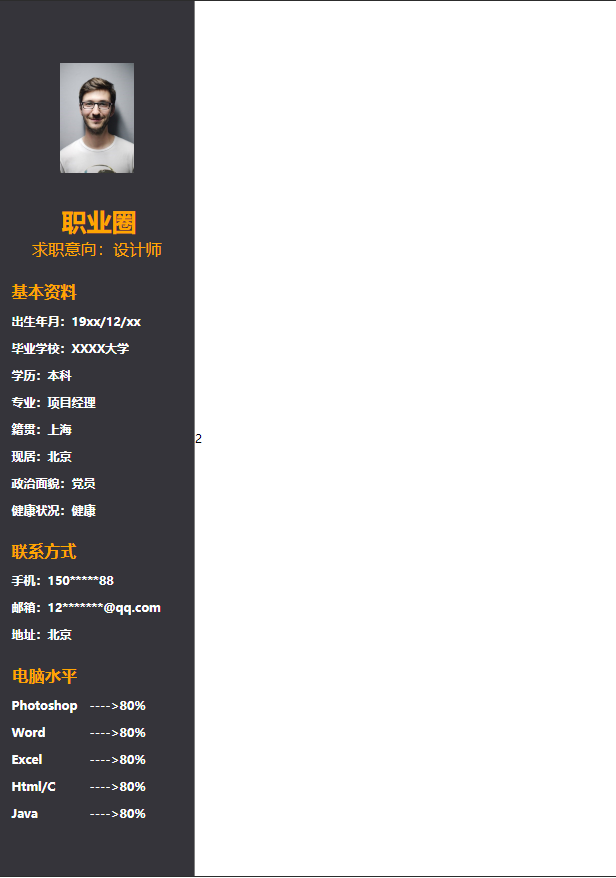