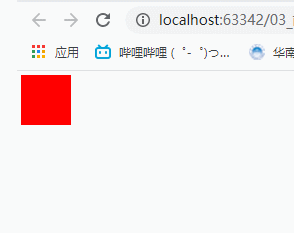
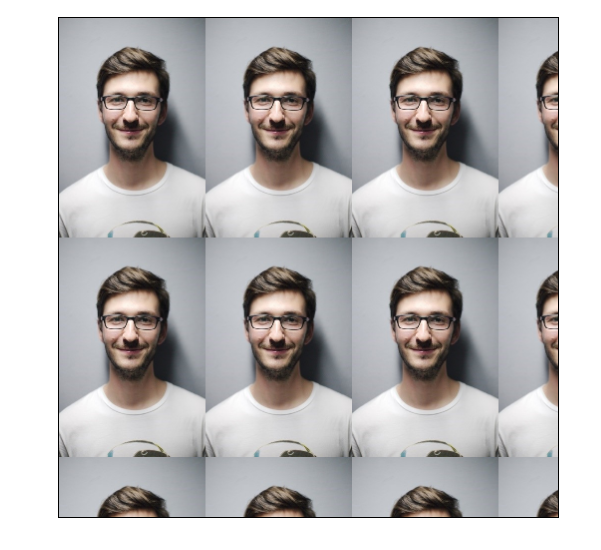
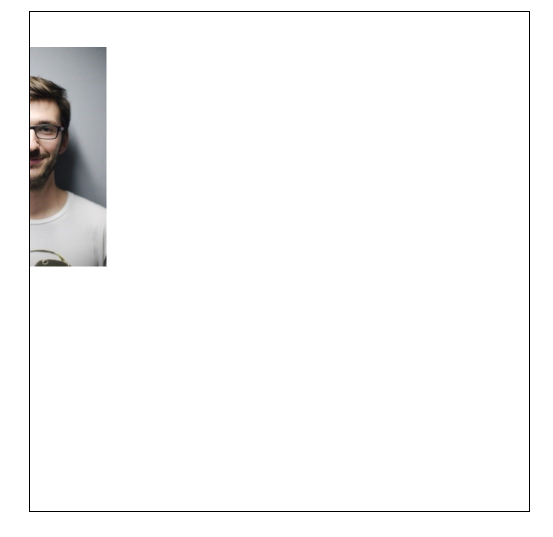

# CSS

在HTML 4之前，HTML不仅只包含文档内容，也包括很多标签属性（比如颜色、大小等），同时又有很多新的标签和属性添加到html中，这使得html文档内容层次越来越不清晰，包含了大量用来修饰标签的属性。

为了使文档和样式分开，创造出了CSS（层叠样式表）。这使得html专注于文档内容和结构，所有的属性用CSS来添加样式，html变得越来越简洁清晰。由于允许同时控制多重页面的样式和布局，CSS 可以称得上 WEB 设计领域的一个突破。作为网站开发者，你能够为每个 HTML 元素定义样式，并将之应用于你希望的任意多的页面中。如需进行全局的更新，只需简单地改变样式，然后网站中的所有元素均会自动地更新。

## CSS基本语法

CSS语法基本由两个部分组成：`选择器 {键：值； 键：值； 键：值}`

选择器一把是html元素，键一般是样式属性，值是大小。例如：`p {color: red; font-size:16px;}`表示选择器`p`标签，然后给标签添加红的，字体大小`16px`。

## CSS页面引用

CSS允许应用在多个页面，即一个html文档可以引用多个不同的CSS文件，来达到不同的显示效果。当同一个html引用了多个页面会显示哪个CSS呢？来看看优先级。

1. 内联样式（**优先级最高**）

    通过`style`属性在元素内部添加样式，例如

    ```html
    <body>
    	<p style="color:red;font-size:14px;">现在演示内联样式，添加颜色和字体大小</p>
    </body>
    ```

2. 内部样式表（**优先级高**）

    把CSS在`<head>...</head>`里，例如：

    ```html
    <!DOCTYPE html>
    <html lang="en">
    	<head>
    		<meta charset="UTF-8">
    		<style type="text/css">            # 内部样式表
                div {
                    color:green;
                    font-size:20px;
                }
    		</style>
    	</head>
    	<body>
            <div>
                只是内部样式表，CSS样式写在head里
            </div>
        </body>
    </html>
    ```

3. 外部样式表（**优先级低**）

    新建一个以`.css`结尾CSS文件，比如：新建`test.css`，打开文件在里面写样式。

    ```css
    div {
        color: red;
        font-size: 25px;
    }
    ```

    然后新建一个html文件，通过标签`<link>`链接引入。

    ```html
    <!DOCTYPE html>
    <html>
        <head>
            <meta charset="utf-8">
            <link rel="stylesheet" type="text/css" href="./css/test.css">
        </head>
        <body>
            <div>这是外部样式表，需要新建CSS文件</div>
        </body>
    </html>
    ```

    ## CSS注释

    注释可以用来解释，浏览器会忽略注释。

    CSS注释格式`/* 这是CSS的注释 */`

    ```css
    p {
        color: red;
        /* 字体大小设置为20px */
        font-size: 20px;
    }
    ```

    ## CSS选择器

    CSS中有跟多种选择器，标签选择器、id选择器、class选择器、层级选择器、组选择器和伪类选择器等。

    **标签选择器**

    ```css
    div {
        color: red;
        font-size: 20px;
    }
    ```

    ```html
    <div id="test">
        司法部好地方v大范甘迪大范甘迪发送给第三方是
    </div>
    ```

    **id选择器**

    id选择器可以标定特有的html元素，为其指定样式，CSS中的id选择器用`#`来标识。例如：

    ```css
    #test {
        color: red;
        font-size: 20px;
    }
    ```

    ```html
    <div id="test">
        司法部好地方v大范甘迪大范甘迪发送给第三方是
    </div>
    ```

    **class选择器**

    class可以标定一组元素，为其指定样式，只要class相同的均可以得到样式，用`.`来标识。例如：

    ```css
    .test1 {
        color: red;
        font-size: 20px;
    }
    ```

    ```html
    <div class="test1">司法部好地方v大范甘迪大范甘迪发送给第三方是</div>
    <p class="test1">nvsajhfsjdkfnsdlk</p>
    <span class="test1">sdafjsadlkvjasbvlkjba</span>
    ```

    **NOTE**：id不能重复，必须是唯一的，class可以重复。一般添加CSS样式常用class选择器，id选择器主要用在JavaScript里。

    **层级选择器**

    主要应用在选择父元素下的子元素，或者子元素下面的子元素，可与标签元素结合使用，减少命名，同时也可以通过层级，防止命名冲突。

    ```css
    .box span {
        color:red;
    }
    .box a {
        font-size:16px;
    }
    ```

    ```html
    <div class="box">
        <span>11111</span>
        <a href="http://baidu.com">baidu</a>
    </div>
    ```

    **组选择器**

    ```css
    /* 把一组的字体大小设置相同 */
    .test1, .test2, span {
        font-size:20px;
    }
    ```

    ```html
    <div class="test1">司法部好地方v大范甘迪大范甘迪发送给第三方是</div>
    <p class="test2">nvsajhfsjdkfnsdlk</p>
    <span>sdafjsadlkvjasbvlkjba</span>
    ```

    **伪类选择器**

    常用的伪类选择器有hover，表示鼠标悬浮在元素上时的状态，伪元素选择器有before和after,它们可以通过样式在元素中插入内容。

    ```css
    div {
        width:100px;
        height:100px;
        background-color:red;
    }
    div:hover {     /*表示这个div被鼠标激活时，改变颜色为绿色*/
        background-color:green;
    }
    ```

    ```html
    <div> </div>
    ```

    效果如下：

    

    ## CSS 文本样式

    | 样式              | 作用             | 栗子                                       |
    | ----------------- | ---------------- | ------------------------------------------ |
    | `color`           | 设置文字颜色     | `color:green`                              |
    | `font-size`       | 设置文字大小     | `font-size:16px`                           |
    | `font-family`     | 设置文字字体     | `font-family:"Microsoft YaHei"`            |
    | `font-style`      | 设置字体是否倾斜 | `font-styel: italic`                       |
    | `font-weight`     | 字体是否加粗     | `font-weight：bold`                        |
    | `font`            | 同时设置多个属性 | `font:normal 12px/16px 'Microsoft Ya Hei'` |
    | `line-height`     | 设置文字行高     | `line-height:24px`                         |
    | `text-decoration` | 设置文字下划线   | `text-decoration:none`                     |
    | `text-indent`     | 文字首行缩进     | `text-indent:24px`                         |
    | `text-align`      | 文字对齐方式     | `text-algin:center`                        |

    **note**:font属性建议按顺序写，`font:是否加粗 字号/行高 字体类型`

## CSS背景属性

CSS中的背景属性定义了背景颜色、背景图片等，是一个非常常用和重要的属性。它包括下面一些背景效果：

* background-color  设置背景颜色
* background-image 设置背景图片
* background-repeat 设置背景图片是否重复
* background-attachment
* background-position 设置背景图片的位置

1. background-color

    ```css
    body {
        background-color: #ffffff;  # 给body设置背景颜色ffffff
    }
    ```

    CSS中，颜色使用有三种方式：

    * 十六进制，如`#efefef`
    * RGB格式，如`rgb(255,0,0)`
    * 颜色名称，如`red`

2. background-image

```html
<head>
    <meta charset="UTF-8">
    <title>Title</title>
    <style>
        .box {
            margin: 50px auto;
            width: 1000px;
            height: 1000px;
            border: 1px solid black;
            /* background-image设置 */
            background-image: url("./imges/man.jpg")
        }
    </style>
</head>
<body>
    <div class="box"></div>
</body>
```

`man.jpg`如下图:


**background-image设置效果**

默认

默认background-image会在水平和垂直方向平铺满盒子，但是可以使用background-repeat调整。

3. background-repeat

    `background-repeat: no-repeat;`不重复背景图片平铺

    `background-repeat: repeat-x;`只在x轴平铺背景图片平铺

    `background-repeat: repeat-y;`只在y轴平铺背景图片平铺

4. background-position

    可以利用这个属性改变背景图在盒子中的位置

    `background-position: right top;`背景图靠右，靠上

    `background-position: -140px 70px;`背景图靠右-140px，靠上70px

    例如：

    ```css
    background-image: url("./imges/man.jpg");
    background-repeat:no-repeat;
    background-position: -140px 70px;
    ```

    

5. background-attachment 背景图像是否固定或者随着页面的其余部分滚动

    `background-attachment:scroll;` 背景图随页面滚动，默认为scroll

    `background-attachment:fixed;`背景图不随页面滚动

    `background-attachment:local;`背景图随元素内容的滚动而滚动

    `background-attachment:inherit;`从父元素继承background-attachment的值

6. **background属性简写**

    按照顺序，可以简写为：

    `background: color image repeat position attachment;`

    并不一定全部使用，例如常用的写法：

    `background:url("./images/man.jpg") no-repeat 30px 56px;`