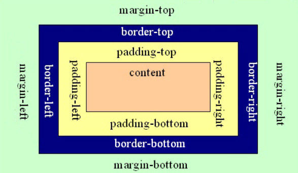

## CSS列表

**`list-style-type`可以指定列表标记项的类型**

例如：

```css
ul.lb1 {list-style-type: square;}
ul.lb2 {list-style-type: circle;}
```

结果：


**`list-style-image`使用列表标记项的图像属性**

```css
ul.lb1 {list-style-image: url("./images/标记.jpg")}
```

结果：


## CSS表格

使用CSS可以使表格更加美观

**表格边框**

给表格添加红色边框

```css
tabel,tr,td {border:1px solid red}
```


表格出现双边界，因为表格table和内部元素td相互独立，可以使用border-collapse属性去掉双边框。

**去掉双边框**

```css
table,tr,td{
    border:1px solid red;
    border-collapse:collapse;
}
```


**表格的宽度和高度**

```css
table {
    width:100%；
    height:100%;
}
td {
    width:50px;
    height:20px;
}
```

**表格文字对齐方式**

水平对齐属性：`text-align`值有center,left,right

垂直对齐属性：`vertical-align`值有top,middle,bottom

**表格内容的内边距**

可以使用`padding:15px;`

**表格背景颜色**

```css
table,tr,td {
    background-color:orange;
}
```


## CSS盒子模型（重点）

CSS盒子模型把所有的html标签元素看成一个盒子，标签包括的是盒子里的内容。盒子有外边距（理解为显示中与别的物品的距离）、边框（理解为盒子的边框厚度）、内边距（理解为盒子内的物品与边框之前的距离）。



把元素叫做盒子，html页面是由多个盒子排列组成的，盒子与盒子之间的距离叫做`margin`，盒子边框`border`，盒子里内容与边框之间的距离`padding`。

**元素的宽和高**

***NOTE***：一定注意，使用CSS样式设置的宽和高只是盒子里内容的宽和高，不包括边框和内边距。

```css
div {
    width: 100px;
    height:50px;
    padding: 30px;
    margin: 20px;
    border: 1px solid #fff;
}
```

盒子的宽=100+30*2+1+1

盒子高=50+30*2+1+1

盒子占的总宽度=盒子的宽+20*2

盒子占的总高度=盒子的高+20*2

**margin和padding的编写方式**

`margin: 20px` 表示上下左右都是20px

`margin: 20px 30px 50px`表示上为20px，左右30px，下为50px

`margin: 20px 30px`表示上下20px，左右30px

padding和margin方式相同

**border编写方式**

```css
border-width:1px;
border-color:red;
border-style:solid;
```

可以简写为：`border:1px solid red`

**margin小方法**

* 让元素居中，可以用`margin:0 auto;`意思是上下外边距0，左右居中。

* margin设置为负值可以让元素位移，让边框合并，比如下面的代码

    ```
        <style>
            .box1 {
                width: 100px;
                height: 100px;
                border: 1px solid black;
                display: inline-block;
                margin: 0;
            }
            .box2 {
                margin-left: -6px;
                width: 100px;
                height: 100px;
                border: 1px solid black;
                display: inline-block;
            }
        </style>
    <body>
        <div class="box1"></div>
        <div class="box2"></div>
    </body>
    ```


**外边距合并问题**


如图，当你给两个盒子都设置了`margin:20px`时，按理说，两个盒子之间应该是40px，但却发现只有20px。这就是外边距合并问题，而且合并会去盒子最大的外边距的值，作为两盒子之间的距离。

**margin-top塌陷问题**


这就是margin塌陷问题，解决方法：

* 给外面盒子加一个`border`

* 外部盒子加一个`overflow:hidden`

* 使用伪类元素——专业方法

    ```css
    .clearfix:before {
        content:'';
        display:table;
    }
    ```

    给外面盒子加一个`clearfix`类即可

**小练习**


```html
<!DOCTYPE html>
<html lang="en">
<head>
    <meta charset="UTF-8">
    <title>Title</title>
    <style type="text/css">
        * {margin: 0;}
        .box {
            margin: 50px auto;
            width: 400px;
            height: 50px;
            border-top: 1px solid #f00;
            border-bottom: 3px solid #666;
        }
        .box p {
            font: 20px/50px "Microsoft YaHei";
            color: #333;
            text-indent: 20px;
        }
    </style>
</head>
<body>
    <div class="box">
        <p>
            PHP是世界上最好的语言
        </p>
    </div>
</body>
</html>
```

## CSS元素溢出

如果子元素内容超出父元素时，需要使用`overflow`设置子元素溢出格式。

`overflow:visible;`默认为visible，元素会超出显示


`overflow:hidden;`超出元素会被隐藏，此属性还有清除浮动、清除margin-top塌陷的功能

`0verflow:scroll;`超出会显示滚动条


`overflow:atuo;`元素不超出不显示滚动条，超出会显示滚动条