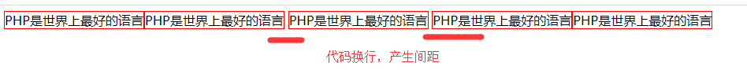
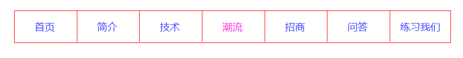
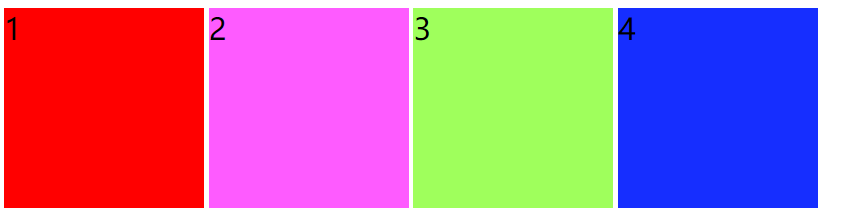
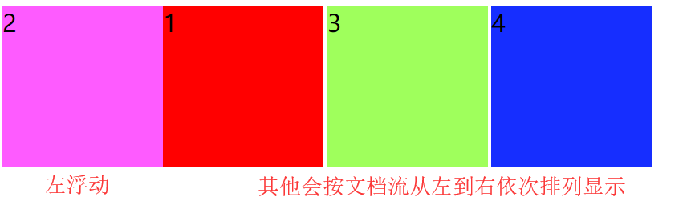
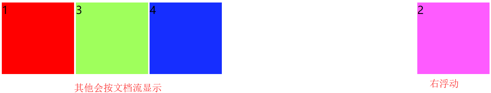

## CSS中display属性

html标签就是元素，可以分为三类，块元素、行内元素、行内块元素。**（重点）**

### 块元素

块元素也叫行元素，特点就是元素盒子独占一行，如果没有设置宽度就默认为父元素宽度。比如常用的标签：`div,p,ul,ol,li,h1-h6,dl,dt,dd,form,table`等都是块元素，支持所有的CSS样式。

### 行内元素

行内元素也叫内联元素，比如：`a,span,em,b,strong,i,img,input,label`等都是行内元素。

* 多个行内元素在一行内，紧挨着并排排列

* 不能给行内元素设置宽度和高度，其宽高根据内容大小变化

* 不能给行内元素设置内边距和外边距的top以及bottom，可以设置left和right

* 行内元素的父元素可以用`text-align`设置水平对齐方式，使用`line-height`设置垂直对齐放方式

* 代码里有换行，会产生间距，如下图：

    ```htm
    	<span>PHP是世界上最好的语言</span><span>PHP是世界上最好的语言</span>
        <span>PHP是世界上最好的语言</span>
        <span>PHP是世界上最好的语言</span><span>PHP是世界上最好的语言</span>
    ```

    

    **解决方法**

    1. 去掉换行。但是可能代码阅读性差
    2. 先设置父元素`font-size: 0;`，再设置子元素的`font-size`即可。

### 行内块元素

也叫内联快元素，简单来说就是行内元素，但是可以支持设置宽和高，而不再宽和高很久内容变化。现在没有标签属于这个类别，但是所有标签都可以使用`display`转化成行内块元素。它有行内元素的所有特点，同时支持设置宽和高，支持全部CSS样式。

### display属性

```
display:none;   隐藏元素，且不占位置
display:block;  元素转化成块元素
display:inline; 元素转化成行内元素
display:inline-block; 元素转化成行内块元素
```

通过`display`属性，块元素、行内块、行内元素可以相互转化。

## 小练习

制作如下菜单栏



```
<!DOCTYPE html>
<html lang="en">
<head>
    <meta charset="UTF-8">
    <title>菜单栏</title>
    <style type="text/css">
        * {
            margin: 0;
            padding: 0;
        }
        ul {
            width: 694px;
            height: 50px;
            margin: 30px auto;
            border: 1px solid red;
        }
        ul li {
            display: inline-block;
            border-left: 1px solid red;
            height: 100%;
            width: 95px;
            margin-left: -1px;
            text-align: center;
        }
        ul li a {
            text-decoration: none;
            font: 16px/50px "Microsoft YaHei";
            color: #2c32ff;
        }
        ul li a:hover {
            color: #ff19e8;
        }
    </style>
</head>
<body>
    <ul>
        <li><a href="#">首页</a></li>
        <li><a href="#">简介</a></li>
        <li><a href="#">技术</a></li>
        <li><a href="#">潮流</a></li>
        <li><a href="#">招商</a></li>
        <li><a href="#">问答</a></li>
        <li><a href="#">练习我们</a></li>
    </ul>
</body>
</html>
```

# CSS的浮动和定位

## 浮动

了解浮动之前可以先看看什么是html标准文档流？

标准文档流，就是html内容从上到下、从左到右依次排列。块元素会独占一行，从上到下排列，行内元素会从左到右依次排列。

这里有四个行内块元素，会按文档流从左到右排列。



浮动有左浮动`float:left;`和右浮动`float:right;`两种，浮动的元素会靠父元素的左边或右边显示。其他元素会按文档流排列显示。例如：下面分别给2添加左浮动和右浮动





浮动的特点：

* 添加浮动会让行内元素和块元素自动转化为行内块元素
* 相邻浮动元素排列在一行，超出父元素会换行
* 浮动元素后面没有浮动的元素会占据浮动元素的位置，没有浮动的元素内的文字会避开浮动的元素，形成文字饶图的效果
* 子元素浮动无法撑开父元素，需要清除浮动
* 浮动元素之间没有垂直margin的合并

## 清除浮动的方法

1. 父级元素增加`overflow;hidden;`

2. 在最后一个子元素后增加一个div，样式为`clear:both`

3. 最好的清除浮动的方式，增加清除浮动样式类

    ```css
    .clearfix:after,.clearfix:before {content:'';display:table;}
    .clearfix:after {clear:both;}
    .clearfix{zoom:1;}
    ```

## 定位

position 属性指定了元素的定位类型。position 属性的五个值：static、relative、fixed、absolute、sticky。

**static定位**

html默认值，即没有定位，遵循正常的文档流。

**fixed定位**

元素相对于浏览器窗口的位置是固定的，窗口滚动元素不会移动，Fixed定位使元素的位置与文档流无关，因此不占据空间。脱离文档流。

**relative定位**

相对定位元素的定位是相对于它的正常位置，移动相对定位元素，但它原本所占的空间不会改变。精经常用来作为绝对定位元素的容器块。

**absolute定位**

绝对定位的元素相对于已定位的度元素，定位使元素的位置与文档流无关，因此不占据空间。脱离文档流。

**sticky定位**

又叫粘性定位，根据用户页面滚动情况，在relative和fixed之间切换。它的行为就像 **position:relative;** 而当页面滚动超出目标区域时，它的表现就像 **position:fixed;**，它会固定在目标位置。


**堆叠顺序**

定位会使元素脱离文档流，覆盖到其他元素的的上面，这就有了堆叠顺序问题，谁应该放在上面，谁在下面。

使用`z-index`可以指定一个元素的堆叠顺序，`z-index`的数值越大，越显示在上面。

**注意：** 如果两个定位元素重叠，没有指定z - index，最后定位在HTML代码中的元素将被显示在最前面。

## CSS伪类元素

| 选择器            | 示例           | 示例说明                                        |
| :---------------- | :------------- | :---------------------------------------------- |
| :link             | a:link         | 选择所有未访问链接                              |
| :visited          | a:visited      | 选择所有访问过的链接                            |
| :active           | a:active       | 选择正在活动链接                                |
| :hover            | a:hover        | 把鼠标放在链接上的状态                          |
| :focus            | input:focus    | 选择元素输入后具有焦点                          |
| :first-letter     | p:first-letter | 选择每个<p> 元素的第一个字母                    |
| :first-line       | p:first-line   | 选择每个<p> 元素的第一行                        |
| :first-child      | p:first-child  | 选择器匹配属于任意元素的第一个子元素的 <p> 元素 |
| :before           | p:before       | 在每个<p>元素之前插入内容                       |
| :after            | p:after        | 在每个<p>元素之后插入内容                       |
| :lang(*language*) | p:lang(it)     | 为<p>元素的lang属性选择一个开始值               |

**注意：** 在CSS定义中，a:hover 必须被置于 a:link 和 a:visited 之后，才是有效的。a:active 必须被置于 a:hover 之后，才是有效的。