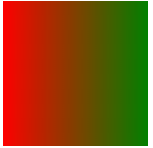

# CSS3

CSS3是控制网页样式和布局新标准，现在已经有很多网页使用CSS3的新标准了。

相对于CSS2，CSS3增加了一些新的样式。

## CSS3边框和圆角

**圆角**

`border-radius`可以很容易的创建圆角

`border-top-right-radius:40px 80px`设置右上角的圆角

`border-radius:10px 20px 30px 40px`设置四个角的圆角

`border-radius:50%`设置四个圆角相同

`border-radius:50px/15px`椭圆边角

- **四个值:** 第一个值为左上角，第二个值为右上角，第三个值为右下角，第四个值为左下角。
- **三个值:** 第一个值为左上角, 第二个值为右上角和左下角，第三个值为右下角
- **两个值:** 第一个值为左上角与右下角，第二个值为右上角与左下角
- **一个值：** 四个圆角值相同

**阴影**

格式`box-shadow:10px(阴影水平偏移) 10px(垂直偏移) 5px(模糊距离) 2px(阴影大小) red(阴影颜色) inset(是否有内阴影) `，只有前两个值是必要的，后面四个值可选。

例如：

```
box-shadow: 10px 10px 10px 2px red;
```


## CSS3背景

`background-origin`指定了背景图像的位置区域，值可以是`content-box,padding-box,border-box`，即在这三个区域放置背景图位置。

`background-clip`背景剪裁属性是从指定位置开始绘制，也是上面三个值的区域。

## CSS3渐变

CSS3中的渐变使用`gradients`可以在两个或者多个颜色之间平稳的过度转换。

以前，如果需要颜色逐渐改变需要在Photoshop中实现，然后使用`img`链接在html页面，过程需要从服务器下载请求图片，现在可以直接通过`gradients`实现颜色渐变。

### 线性渐变`linear-gradient`

格式`background-image: linear-gradient(direction,color1,color2....)`

**渐变颜色方向默认从上到下：**

```
background-image: linear-gradient(red, green);
```


**渐变颜色从左到右：**

```
background-image: linear-gradient(to right, red, green);
```



**渐变颜色对角变化：**

```
background-image: linear-gradient(to right top, red, green);
```


**渐变颜色随意变化：**

```
background-image: linear-gradient(angle, red, green);
```

**`angle`是变化方向的标准角度**


**渐变颜色可以存在多个：**

```
background-image: linear-gradient(90deg, red, yellow, green);
```


**渐变颜色支持透明度：**

```
background-image: linear-gradient(90deg, rgba(255,255,0,0), rgba(255,255,0,1));
```

**渐变颜色可以重复：**

```
background-image: repeating-linear-gradient(90deg, red 10%, green 30%);
```


### 径向渐变`radial-gradient`

格式`background-image: radial-gradient(渐变形状, color1, color2)`

**渐变默认从中心点开始**

```
background-image: radial-gradient(red, green, yellow);  # 均匀分布
background-image: radial-gradient(red 10%, green 30%, yellow 50%);  # 不均匀分布
```

  

**渐变颜色设置**

值可以是`circle`表示圆形，`ellipse`表示椭圆形，默认是椭圆形。

```
background-image: radial-gradient(circle, red, green, yellow);
background-image: radial-gradient(red, green, yellow);
```


**不同形状设置**

值为`closest-side、fathest-side、closest-corner、fathest-corner`

```
background-image: radial-gradient(closest-side at 30% 40%, red, green, yellow);
background-image: radial-gradient(closest-corner at 30% 40%, red, green, yellow);
background-image: radial-gradient(farthest-side at 30% 40%, red, green, yellow);
background-image: radial-gradient(farthest-corner at 30% 40%, red, green, yellow);
```


**重复径向**

```
background-image: repeaingt-radial-gradient(red, green, yellow);
```

## CSS3文本效果

### 文本阴影

`text-shadow`用于文本阴影，一般所用阴影样式都有水平阴影、垂直阴影、模糊距离、阴影颜色四个值。

格式`text-shadow: 水平阴影 垂直阴影 模糊距离 阴影颜色`

```
text-shadow: 20px 20px 5px #000;
```


### 盒子阴影

也可以在` ::before` 和` ::after` 两个伪元素中添加阴影效果

```
box-shadow: 10px 10px 5px #f1eaff;
```


### 文本溢出属性

`text-overflow:clip;`默认值


可以改为`ellipsis`

```
div {
    width: 200px;
    white-space: nowrap;  /*不让文字自动换行*/
    overflow: hidden;
    border: 1px solid #000000;
    text-overflow: ellipsis;
}
```


### 文本换行

和Word中的换行一样，CSS3可以指定是否分裂单词换行。

`word-warp: break-word;`允许长单词分裂换行

`word-break:keep-all; `不分裂单词换行

`word-break:break-all; `分裂单词换行