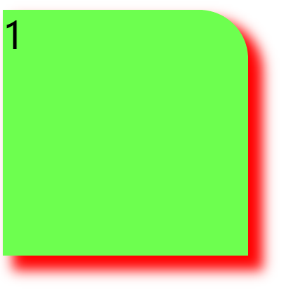

# CSS3

CSS3是控制网页样式和布局新标准，现在已经有很多网页使用CSS3的新标准了。

## CSS3边框和圆角

**圆角**

`border-radius`可以很容易的创建圆角

`border-top-right-radius:40px 80px`设置右上角的圆角

`border-radius:10px 20px 30px 40px`设置四个角的圆角

`border-radius:50%`设置四个圆角相同

`border-radius:50px/15px`椭圆边角

- **四个值:** 第一个值为左上角，第二个值为右上角，第三个值为右下角，第四个值为左下角。
- **三个值:** 第一个值为左上角, 第二个值为右上角和左下角，第三个值为右下角
- **两个值:** 第一个值为左上角与右下角，第二个值为右上角与左下角
- **一个值：** 四个圆角值相同

**阴影**

格式`box-shadow:10px(阴影水平偏移) 10px(垂直偏移) 5px(模糊距离) 2px(阴影大小) red(阴影颜色) inset(是否有内阴影) `，只有前两个值是必要的，后面四个值可选。

例如：

```
box-shadow: 10px 10px 10px 2px red;
```



## CSS3背景

`background-origin`指定了背景图像的位置区域，值可以是`content-box,padding-box,border-box`，即在这三个区域放置背景图位置。

`background-clip`背景剪裁属性是从指定位置开始绘制，也是上面三个值的区域。