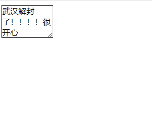

## CSS3多列

| 属性              | 描述                                     |
| :---------------- | :--------------------------------------- |
| column-count      | 指定元素应该被分割的列数。               |
| column-fill       | 指定如何填充列                           |
| column-gap        | 指定列与列之间的间隙                     |
| column-rule       | 所有 column-rule 属性的简写              |
| column-rule-color | 指定两列间边框的颜色                     |
| column-rule-style | 指定两列间边框的样式                     |
| column-rule-width | 指定两列间边框的厚度                     |
| column-span       | 指定元素要跨越多少列                     |
| column-width      | 指定列的宽度                             |
| columns           | 设置 column-width 和 column-count 的简写 |

## CSS3调整元素尺寸

在CSS2中，调整一个元素的尺寸需要改变盒子的宽和高，这是在页面代码中的，用户无法改变元素大小。但是在CSS3中，可以使用`resize`属性使用户用权力改变盒子宽和高。

```
	<style>
        div {
            width: 100px;
            border: 1px solid #000000;
            resize: both;
            overflow: auto;
        }
    </style>
<body>
    <div>武汉解封了！！！！很开心</div>
</body>
```



`box-sizing`可以指定盒子边界。比如默认是宽和高是`content-box`，不包括内边距和边框，但是可以设置为`box-sizing:border-box;`再设置宽和高时就是包括内边距和边框了。

`outline-offset`可以对轮廓偏移，轮廓不占用空间。

## CSS3图片

`border-radius`可以对图片进行圆角设置，也可以创建缩略图。

```
    <style>
        a {
            display: block;
            padding: 15px;
            width: 300px;
            border: 1px solid #000000;
            border-radius: 5px;
        }
        a img {
            width: 300px;
        }
        a:hover {
            box-shadow: 0 0 5px 2px rgba(255, 50, 159, 0.5);
        }
    </style>

<a href="#">
    
</a>
```

效果如图：


## HTML5新布局

h5新增的主要语义化标签如下：
1. header 页面头部、页眉
2. nav 页面导航
3. article 一篇文章
4. section 文章中的章节
5. aside 侧边栏
6. footer 页面底部、页脚


## HTML5 新增表单控件
新增类型：网址 邮箱 日期 时间 星期 数量 范围 电话 颜色 搜索
```
<label>网址:</label><input type="url" name="" required><br><br> 
<label>邮箱:</label><input type="email" name="" required><br><br> 
<label>日期:</label><input type="date" name=""><br><br> 
<label>时间:</label><input type="time" name=""><br><br> 
<label>星期:</label><input type="week" name=""><br><br> 
<label>数量:</label><input type="number" name=""> <br><br>
<label>范围:</label><input type="range" name=""><br><br> 
<label>电话:</label><input type="tel" name=""><br><br> 
<label>颜色:</label><input type="color" name=""><br><br> 
<label>搜索:</label><input type="search" name=""><br><br>
```
新增常用表单控件属性：
1. placeholder 设置文本框默认提示文字
2. autofocus 自动获得焦点
3. autocomplete 联想关键词
## HTML5 音频和视频
html5增加了audio和video标签，提供了在页面上插入音频和视频的标准方法。
**audio标签**:支持格式：ogg、wav、mp3，对应属性：
1. autoplay 自动播放
2. controls 显示播放器
3. loop 循环播放
4. preload 预加载
5. muted 静音
```
<audio src="source/audio.mp3" autoplay controls loop preload></audio>
```

<audio src="source/audio.mp3" autoplay controls loop preload></audio>
```
<audio  autoplay controls loop preload>
    <source src="source/audio1.mp3" type="">
    <source src="source/audio2.wav" type="">
</audio>
```

<audio  autoplay controls loop preload>
    <source src="source/audio.mp3" type="">
    <source src="source/audio02.wav" type="">
</audio>
source标签的作用是提供多个媒体文件地址，如果一个地址的文件不兼容，就使用下一个地址。
**video标签**支持格式：ogg、mp4、webM，属性：
1. width
2. height
3. Poster