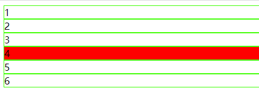
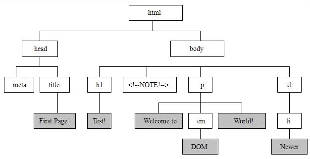
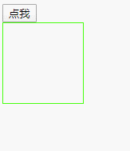
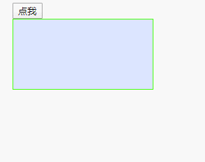

# JavaScript

JavaScript是web的编程语言，是世界上最流行的脚本语言。主要是很容易学习。

前端脚本语言还有JScript（微软，IE独有），ActionScript( Adobe公司，需要插件)等。

前端三大工具：

* HTML：网页的内容
* CSS：网页的样式
* JavaScript：网页的行为

## JS嵌入页面的方式

JS嵌入页面和CSS文件相同，也有3种方式：

1. 行内嵌入

    `<input type="button" name="" onclick=alert("hello world");>`

2. 页面嵌入

    ```
    <script>
        window.onload = function () {
            var ainps = document.getElementById('input');
            alert(ainps);
            ainps.onclick = function () {
                alert('ok!');
            }
        }
    </script>
    ```

    在html页面头部，`<script></script>`中包围的。

3. 外部嵌入

    ```
    <script type="text/javascript" src="js/test.js"></script>
    ```

## JS输出

JS并没有打印或者输出函数，但是JS显示数据的方法也很多，例如：`window.alert()`弹出框，`console.log()`在浏览器控制台显示，`document.write()`可以写入到html文档中，`innerHTML`可以写入html元素。

JS输出是程序调试bug的重要方法。

## JS格式

* JS语句使用分号`;`分隔
* JS具有自己的关键字
* `// 单行注释` 
* `/*多
    行
    注释
    */`
* JS对大小写敏感
* JS使用Unicode字符集
* JS语句按照顺序从上往下执行
* JS会忽略多余的空格
* JS可以在文本字符串中使用反斜杠`\`换行

## JS变量

JS是一种弱类型的语言，JS的变量需要`var`关键字定义，变量的类型有值决定。

```javascript
var aname;
var a=8;
var b="hello";
var c=9,d='qwer',f=678; //可以用var定义多个变量
```

JS有5中基本变量类型，数值、字符创、布尔类型、未定义`undefined`、空`null`。

3种复合类型：对象`object`、数组`array`、函数`function`。

命名规范：

* 区分大小写
* 第一个字符必须是字母、下划线、或者美元符号$

**JS对象**

对象和Python中字典键值对相同，区别的是，JS对象中，键不加引号。

**JS数组**

和Python中数组相同

**JS中undefined和Null**

undefined表示变量不含有值。

NUll可以用来清空变量的值。

## JS对象

JS对象是拥有属性和方法的数据，是变量的容器。

```javascript
var person={
    name:'小明',
    age:28,
    height:"178cm",
    eat:function(){...};
}
```

访问属性可以用`person.name;`或者`person['name'];`

eat是person对象的方法。因此JavaScript 对象是属性和方法的容器。

## JS函数

语法：

```javas
function 函数名() {
	// 代码块
}
```

带有参数和返回值的函数

```javasc
function sum(n1,n2) {
	var s = n1 + n2;
	return;
}
sum(12,56);
```

函数的变量类似Python，有局部变量和全局变量。

局部变量是在函数内部使用`var`声明的，只能在函数内部访问，当函数执行完毕就会被删除。

全局变量是在函数外声明，所有函数都能访问。页面关闭后会被删除。

**变量其实就是对象属性，当创建一个变量，其实就是给对象添加了一个属性。在函数内的变量作用于函数内部，可以在函数内使用，可以用`this.变量`访问。这个函数叫做此变量的作用域。**

**函数变量预解析**

JS解析过程有两个阶段，先编译在执行，编译会将函数定义声明提前，并且将`var`定义的变量赋值为`undefined`，然后在执行阶段给变量赋值。

```
window.onload = function () {
    aa();  //会弹出haha
    alert(bb);  //会弹出undefined
    function aa() {
        alert('haha');
    }
    var bb=24;
    alert(bb); //弹出24
}
```

匿名函数就是不给函数名，例如`window.onload = function () {}`

## 运算符

**算术运算符**

| 运算符 | 描述         | 例子             |
| :----- | :----------- | :--------------- |
| +      | 加法         | x=y+2            |
| -      | 减法         | x=y-2            |
| *      | 乘法         | x=y*2            |
| /      | 除法         | x=y/2            |
| %      | 取模（余数） | x=y%2            |
| ++     | 自增         | x=++y<br />x=y++ |
| --     | 自减         | x=--y<br />x=y-- |

**赋值运算符**

=、 +=、 -=、 *=、 /=、 %=

**条件运算符**

==、===、>、>=、<、<=、!=、&&(而且)、||(或者)、!(否)

**注意：+号运算符具有连接性**

* 可以把两个字符串连接起来
* 连接数字和字符创，例如`5+"5"`，结果为`55`，结果最后为字符串类型

## JS获取html元素方法

`document.getElementById()`来获取html元素的id属性。例如

```
var odiv = document.getElementById('box');
odiv.style.width = '100px';
```

将`#box`盒子的宽度改为100px。

由于JS从上往下顺序执行，可能会导致浏览器html页面为加载，就直接执行JS文件，然后产生错误。因此，可以将JS代码放进`window.onload=function(){...}`里，表示等加载完html后执行JS代码。

```
<script>
   window.onload = function () {
       var odiv = document.getElementById('box');
       odiv.style.width = '100px';
   }
</script>
```

## JS访问元素属性

例如`<div id="box"></div>`，需要先获取div，通过`var oDiv = document.getElementById('box');`

访问属性有两种方法

* `oDiv.style.width = '100px';`通过`.`方法
* `oDiv.style['width'] = '100px;`通过`[]`的方法，要加引号

属性写法和CSS相比有改变：

* `class`属性要写成`className`
* `style`属性里有恒线`-`的属性要改为小驼峰，例如CSS`font-size`写成`fontSize`

## 数组操作方法

**定义数组**

* `var aList=New Array(4,5,6);`通过对象实例创建
* `var aList=[4,5,6,'hello'];`直接创建

**获取数组长度**`length`

**下标查找元素**`aList[2]`

**将数组分隔成字符串**`join()`

**从最后增加元素**`push()`

**从最后删除元素**`pop()`

**从最前面增加元素**`unshift()`

**从最前面删除元素**`shift()`

**将数组反转**`reverse()`

**返回数组中元素第一次出现的索引值**`indexOf()`

**在指定位置删除元素，然后增加元素**`splice()`，例如

```
var aList=[4,5,6,'hello'];
aLsit.splice(1,2,3,3,3); //从第一个元素开始，删除2个元，并增加3,3,3
alert(aList) //结果为[4,3,3,3,'hello']
```

**获取HTML元素**`document.getElementsByTagName('')`获取元素集合，并不是数组，但是可以用下标索引。

```javascript
<script>
   window.onload = function () {
       var oDivs = document.getElementsByTagName('div'); //获取所有的div元素
       oDivs[3].style.backgroundColor = 'red';  //下标为3的背景变红
   }
</script>
```



## 循环语句

for循环

```
for (var i=1, i<=100, i++){
	//循环代码
}
```

while循环

```
var i=0;
while (i<100) {
	//循环代码
	i++
}
```

## JavaScript的组成

JavaScript是一种脚本语言，遵循ECMAScript规范，ECMAScript不是编程语言，只是一种脚本语言规范。比如，微软的JScript和Flash的ActionScript都遵循ECMAScript的规范。

JavaScript其实是由三部分组成的：

* ECMAScript：这是JavaScript的所遵循的规范
* DOM：Document Object Model，文档对象模型
* BOM：Browser Object Model ，浏览器对象模型

**DOM**：其实就是html，提供了很多元素节点和它们的操作方法，整个html文档所用的方法其实是数据结构里的**树**的模型，可以看成一棵树，所有的元素节点看成树的节点。



**BOM**：规定了操作浏览器的接口，比如可以通过JS控制浏览器的大小、历史记录、刷新、后退等常用的操作。（虽然现在浏览器上都有这些按钮，但是也可以自己去定义）

## 字符串处理方法

1. 字符串合并操作：“` +` ”
2. `parseInt()` 将数字字符串转化为整数
3. `parseFloat()` 将数字字符串转化为小数
4. `split() `把一个字符串分隔成字符串组成的数组
5. `charAt()` 获取字符串中的某一个字符
6. `indexOf() `查找字符串是否含有某字符
7. `substring() `截取字符串 用法： substring(start,end)（不包括end）
8. `toUpperCase() `字符串转大写
9. `toLowerCase() `字符串转小写

## 定时器

在JS中，有时候不需要立刻执行函数，而是需要在一定时间后执行，需要用到定时器。例如在电商活动抢购页面，会出现倒计时，倒计时为0，会挑战到支付页面，这就是使用的定时器，在一定时间后加载另一个页面。

* `setTimeout()`在指定毫米后执行指定代码
* `setInterval()`间隔指定时间不停的执行代码

**注意**：这两个函数是HTML DOM window对象的两个方法。

**setTimeout()**

格式：`myAlert = setTimeout(函数, 毫秒)`，此函数有返回值，取消定时器时使用，`clearTimeout(myAlert)`，**注意**创建的myAlert必须是全局变量。

```javascript
    <script>
       window.onload = function () {
           var oBtn = document.getElementById('btn');
           var oDiv = document.getElementById('content');
           var myAlert;
           oBtn.onclick = function () {  //按钮点击倒计时
               myAlert = setTimeout(showDate, 3000);  //创建定时器
           };
           clearInterval(myAlert);  //清除定时器
        	//定时器指定函数
           function showDate() {
               oDiv.innerText = '倒计时三秒后出现！';
           }
       }
    </script>
<body>
    <button id="btn">点我</button>
    <div id="content"></div>
</body>
```



**setInterval()**

格式和`setTimeout`用法相同。

```
    <script>
       window.onload = function () {
           var oBtn = document.getElementById('btn');
           var oDiv = document.getElementById('content');
           var myAlert;
           oBtn.onclick = function () {
               myAlert = setInterval(showDate, 1000);  //创建定时器
               showDate();  //上一句有1s延迟，下面执行一次可以清除延迟。
           };
           clearInterval(myAlert);  //清除定时器
           //定时器函数
           function showDate() {
               var d = new Date(); //创建日期对象
               oDiv.innerHTML = d.toLocaleDateString() + d.toLocaleTimeString();
           }
       }
    </script>
<body>
    <button id="btn">点我</button>
    <div id="content"></div>
</body>
```



## 数据类型转换

在 JavaScript 中有 6 种不同的数据类型：

`string、number、boolean、object、function、symbol`
3 种对象类型：

`Object、Date、Array`
2 个不包含任何值的数据类型：

`null、undefined`

**使用typeof查看数据类型**

```
alert(typeof 55)  //弹出number
alert(typeof 'tom')  //弹出string
alert(typeof function(){})  //弹出function
alert(typeof true)  //弹出boolean
```

**注意**：

* `NaN`是`number`类型
* 数组、日期、`null`是`object`类型
* 未定义的数据为`undefined`类型

**constructor返回变量的构造函数**

```
alert(true.constructor); //返回函数 Boolean() { [native code] }
alert((123).constructor); //返回函数 Number()  { [native code] }
alert(function () {}.constructor); //返回函数 Function(){ [native code] }
```

使用此属性也可以判断是否是指定数据，比如查看数据是否是数组：

`return myArray.constructor.toString().indexOf("Array") > -1;`如果是会返回true

**数字转化为字符串**

* `String(123)`

* `(123).toString()`

* `''+123`

* 下面三个方法均可以将数字转化为字符串，**结果都是字符串**

    | 方法              | 描述                                                 | 例如     | 结果        |
    | :---------------- | :--------------------------------------------------- | -------- | ----------- |
    | `toExponential()` | 把对象的值转换为指数计数法。                         | 1234.456 | 1.234456e+3 |
    | `toFixed(2)`      | 把数字转换为字符串，结果的小数点后有指定位数的数字。 | 1234.456 | 1234.45     |
    | `toPrecision(2)`  | 把数字格式化为指定的长度。                           | 1234.456 | 12          |

**布尔值转化为字符串**

`String(false)     // 返回 "false"`

`true.toString()   // 返回 "true"`

**日期转化为字符串**

* `Date() //返回字符串Thu Apr 09 2020 11:04:52 GMT+0800 (中国标准时间)`
* `String(new Date())   // 返回 Thu Apr 09 2020 11:04:52 GMT+0800 (中国标准时间)`
* Date 方法 **toString()** 也有相同的效果
* 下面方法也都可以把日期转换为字符串

| 方法                | 描述                                        |
| :------------------ | :------------------------------------------ |
| `getDate()`         | 从 Date 对象返回一个月中的某一天 (1 ~ 31)。 |
| `getDay()`          | 从 Date 对象返回一周中的某一天 (0 ~ 6)。    |
| `getFullYear()`     | 从 Date 对象以四位数字返回年份。            |
| `getHours()`        | 返回 Date 对象的小时 (0 ~ 23)。             |
| `getMilliseconds()` | 返回 Date 对象的毫秒(0 ~ 999)。             |
| `getMinutes()`      | 返回 Date 对象的分钟 (0 ~ 59)。             |
| `getMonth()`        | 从 Date 对象返回月份 (0 ~ 11)。             |
| `getSeconds()`      | 返回 Date 对象的秒数 (0 ~ 59)。             |
| `getTime()`         | 返回 1970 年 1 月 1 日至今的毫秒数。        |

**将字符串转换为数字**

```
Number('1.12') //返回1.12
Number("")    //返回0
Number('tom')  //返回NaN
parseInt(3.9)  //返回3
parseInt('3.9')  //返回3
paesrFloat(3.9)  //返回3.9
paesrFloat('3.9')  //返回3.9
```

如果字符串不能转换，最后仍然是一个数，只不过结果是NaN。

`+`运算符也可以将字符串转换数字，例如：

```
var x='45';
var y= +x;  //类型为number
var a = 'tom';
var b = +a;  //类型为NaN

//布尔转换为字符串
Number(false) //返回0
Number(true)  //返回1

//日期转换为数字
myDate = new Date();
Number(myDate);  //返回1586403161212
myDate.getTime();  //返回1586403161212
```

**特殊类型转换——重点注意区别**

```
'4' + 2 //返回'42'
'4' - 2 //返回2
'4' + null //返回'4null'
4 + null //返回4
```

