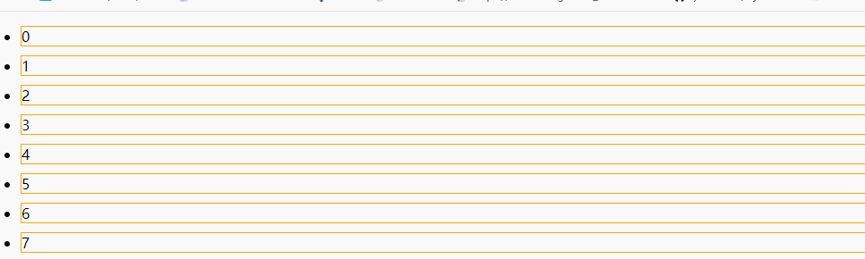

## 封闭函数

封闭函数其实就是自己调用自己的匿名函数。

一般的函数

```
function () {
	alert('haha');
}
```

上面这个函数是不可能执行的，因为内用被调用。但是封闭函数会自己调用自己，然后执行。例如

```
(function(){
	alert('haha');
})();
```

在匿名函数后面加一个小括号，表示调用。还可以在函数定义前加上“~”和“!”等符号来定义匿名函数

```
!function(){
	alert('haha');
}();
```

## 闭包

闭包其实就是嵌套函数，就是内部函数可以引用外部函数的参数和变量，参数和变量不会被垃圾回收机制收回。（有点难理解，来看个例子）

**怎么写数值一直增加的函数呢？**

```
function add() {
	var a=0;
	return a+=1;
}
alert(add()); //弹出1
alert(add()); //弹出1
alert(add()); //弹出1
```

不管调用多好次都是1，以为a是局部变量，调用完成后就会删除a，在此调用时，a的初值还是0.改进一下：

```
var a=0;
function add() {
	return a+=1;
}
alert(add()); //弹出1
alert(add()); //弹出2
alert(add()); //弹出3
```

把a放到函数外面就是全局变量，可以储存每次调用函数后的返回值。看似是对的，但是这个函数有很大问题。全局变量是所有的函数脚本都可以调用的，每个函数都可以更改全局变量，如果别的函数改变了a的值，那这个函数就不是自增函数了。因此随便更改全局变量是很不安全的，如果像Python的类里有一种私有变量就好了，闭包就可以实现相同的功能。

```
var outside = (function () {
    var a=0;  //外部函数的局部变量
    function inside() {
        return a+=1;  //这是内函数，可以调用外函数的变量a
    }
    return inside;   //返回内函数的函数体对象
})();
alert(outside());  //弹出1
alert(outside());  //弹出2
alert(outside());  //弹出3
```

上面的函数实现了自增，并且使用局部变量，不会被其他函数使用，成为了函数的私有变量。

因此**闭包是保护函数私有变量的一种方式，不受外界干扰**。用数据结构中的知识解释，就是形成了一个不销毁的栈。简单说一下，就是任何函数调用都会产生一个函数调用栈，比如A函数嵌套B函数，B函数里嵌套C函数，C函数里嵌套D函数。调用A函数时，会把A丢进栈，因为A没有具体返回值并且嵌套会找到B函数，再把B 函数丢进栈，同样会把C丢进栈，最后把D丢进栈。因为D内用内嵌套函数，并且有返回值，D会执行并且出栈，然后把D的返回值给C，C有了返回值就可以出栈，然后值给B，B出栈把值A，A执行完毕出栈，最后栈清空，函数调用结束。

**作业**：怎么实现下面的效果呢？



这是8个`li`无序列表，点击任意一个就会弹出其对应的数字。

```HTML
//CSS部分
<style>
    ul li {
        border: 1px solid #ffa500;
        margin: 10px;
    }
</style>
//html部分
<body>
    <ul>
        <li>0</li>
        <li>1</li>
        <li>2</li>
        <li>3</li>
        <li>4</li>
        <li>5</li>
        <li>6</li>
        <li>7</li>
    </ul>
</body>
```

一般情况JS部分这样写：

```
<script>
window.onload = function () {
    var aLis = document.getElementsByTagName('li'); //先获取元素
    for (var i=0;i<aLis.length;i++) {  //for循环遍历
        aLis[i].onclick = function () {  //给每个li绑定点击事件
        	alert(i);
        }
    }
}
</script>
```

但是最后结果，不管点击哪个`li`都是弹出7。**问题出在for循环**，因为for循环从`0-7`遍历速度特别快，在点击之前`i`的值已经到7了，所以结果都是7。因此需要做的是，记录每次增加的`i`的值，可以用到闭包，保护私有变量。

正确的JS这么写：

```
<script>
   window.onload = function () {
        var aLis = document.getElementsByTagName('li');
        for (var i=0;i<aLis.length;i++) {
            (function (i) {    //使用了闭包，记录了遍历索引
                aLis[i].onclick = function () {
                    alert(i);
                }
            })(i);
        }
   }
</script>
```

## JS中的对象方法

1. document

```
document.referrer  //获取上一个跳转页面的地址(需要服务器环境)
```

2. location

```
window.location.href  //获取或者重定url地址
window.location.search //获取地址参数部分
window.location.hash //获取页面锚点或者叫哈希值
```

3. Math

```
Math.random 获取0-1的随机数
Math.floor 向下取整
Math.ceil 向上取整
```

# JS面向对象

和大多数编程语言一样，JS也有面向对象思想。JS将所用的变量和函数组合起来，叫对象，对象的变量叫属性，对象的函数叫方法。

创建对象的方法

1. 单体模式

    ```
    var dog = {
    	name:'taidi',
    	age:2,
    	eat:function(){
    		alert('吃饭中');
    	},
    	run:function(){
    		alert("跑步");
    	}
    }
    ```

    但是一个一个创建对象很麻烦，可以使用工厂模式。

2. 工厂模式

    ```
    <script>
    	function Dog(name,age) {  //先创建一个工厂，即一个函数
    		var d = new Object();   //表示创建一个对象
    		d.name=name;
    		d.age=age;
    		d.eat=function(){alert('吃饭中');};
    		d.run=function(){alert("跑步");};
    		return d;  //把对创建的对象返回
    	}
    	var dog1 = Dog('taidi',2);
    	dog1.eat();
    	dog1.run();
    	var dog2 = Dog('tom',3);
    	dog2.eat();
    </script>
    ```

    工厂模式其实就是在函数内部创建对象，重复调用函数。

3. 构造函数——工厂模式的另一种写法而已

    ```
    <script>
    	function Dog(name,age) {
    		this.name = name;
    		this.age = age;
    		this.eat = function(){alert('吃饭中');};
    		this.run = function(){alert("跑步");};
    	}
    	var dog1 = new Dog('taidi',2);
    	var dog2 = new Dog('tom',3);
    	alert(dog1.eat==dog2.eat);  //弹出false
    </script>
    ```

    **注意注意**：狗1的`eat`和狗2的`eat`方法不相等，也就是说不是同一个方法，也就是说在内存中，存在两个`eat`方法，也就是说使用`new Dog()`创建一个对象就会分配一个对象的内存空间，内存空间中有该对象的属性和方法。

    **全世界无数条狗，全世界的硬盘加起来也不够储存的啊**

    能不能就一个`eat`方法，哪个狗吃就哪个狗调用，下个狗来还调用此方法吃饭呢？

4. 原型模式创建对象

    JS所有的对象是从哪里来的呢？都在来自于一个原型对象`prototype`，所有的对象都会继承原型对象`prototype`的属性和方法。**试想一下**：如果把上面`eat`方法添加原型对象中，那么所有创建的对象都会继承这个方法，就可以实现一个方法，多个对象使用。

    ```
    <script>
    	function Dog(name,age) {
    		this.name=name;
    		this.age=age;
    	}
    	Dog.prototype.eat = function(){alert('吃');};
    	Dog.prototype.run = function(){alert('跑');};
    	var dog1 = new Dog('taidi',2);
    	var dog2 = new Dog('tom',3);
    	alert(dog1.eat==dog2.eat);  //弹出true
    </script>
    ```

5. 继承

    ```
    //父对象
    function Dog(name,age) {
        this.name=name;
        this.age=age;
    }
    Dog.prototype.eat = function(){alert('吃');};
    Dog.prototype.run = function(){alert('跑');};
    //子对象
    function girl_dog(color) {
    	Dog.call(this,name,age);  //继承父亲属性
    	this.color = color;
    }
    girl_dog.prototype = new Dog();  //继承父亲属方法
    girl_dog.prototype.sing = function(){alert('唱歌');};
    var dog1 = girl_dog('meimei',1,'白色')；
    dog1.eat();
    ```

    

