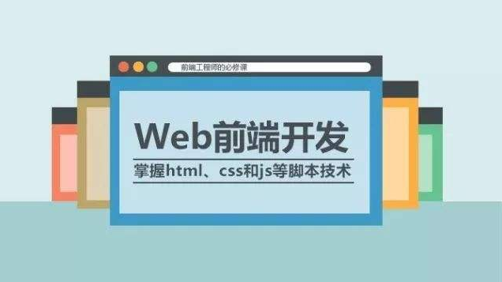

# web前端

前端就是网站前台部分，运行在PC端，移动端等浏览器上展示给用户浏览的网页。前端一般分为前端设计和前端开发两个部分。前端设计师网站页面的视觉设计，前端开发是通过代码来实现页面效果。前端开发基本包括*HTML*和*CSS*以及*JavaScript/ajax*，有现在流行的*HTML5*和*CSS3*等。

# web开发核心技术

**HTML             CSS        JavaScript   三大块**

这三个是前端中最最基本的三个技能。

**HTML**

*HTML*是[超文本标记语言]([https://baike.baidu.com/item/HTML/97049?fromtitle=%E8%B6%85%E6%96%87%E6%9C%AC%E6%A0%87%E8%AE%B0%E8%AF%AD%E8%A8%80&fromid=6972570&fr=aladdin](https://baike.baidu.com/item/HTML/97049?fromtitle=超文本标记语言&fromid=6972570&fr=aladdin))(*HyperText Markup Language*)，是网站页面里的标识性语言。它是通过一系列的标签将网站上文字、图片、链接等链接为一个统一的整体。

*HTML*文档制作不是很复杂，但是功能强大，支持不同数据格式的文件嵌入，另外，HTML简单已读，可扩展性很高，平台无关性，重要的是HTML全世界通用。

**CSS**

[层叠样式表](https://baike.baidu.com/item/CSS/5457)(*Cascading Style Sheets*)，是一种用来美化HTML页面的重要工具。不仅可以静态的修饰页面，可以配合JavaScript等脚本语言来动态的修饰页面。CSS能够对页面中的元素位置的排版进行像素即的精确控制，几乎支持所用的字体字号样式。

CSS具有丰富的样式定义、易于修改、多页面应用、层叠、页面压缩等特点。

**JavaScript**

[JavaScript](https://baike.baidu.com/item/javascript)（简称“JS”） 是一种具有函数优先的轻量级，解释型或即时编译型的编程语言。虽然它是作为开发Web页面的脚本语言而出名的，但是它也被用到了很多非浏览器环境中，JavaScript 基于原型编程、多范式的动态脚本语言，并且支持面向对象、命令式和声明式（如函数式编程）风格。

# web前端开发工程师

Web前端开发工程师，是从事Web前端开发工作的工程师。主要进行网站的开发、优化、完善的工作。

>一位好的Web前端开发工程师在知识体系上既要有广度，又要有深度，所以很多大公司即使出高薪也很难招聘到理想的前端开发工程师。现在说的重点不在于讲解技术，而是更侧重于对技巧的讲解。技术非黑即白，只有对和错，而技巧则见仁见智。以前会Photoshop和Dreamweaver就可以制作网页，现在只掌握这些已经远远不够了。无论是开发难度上，还是开发方式上，现在的网页制作都更接近传统的网站后台开发，所以现在不再叫网页制作，而是叫Web前端开发。Web前端开发在产品开发环节中的作用变得越来越重要，而且需要专业的前端工程师才能做好，这方面的专业人才备受青睐。Web前端开发是一项很特殊的工作，涵盖的知识面非常广，既有具体的技术，又有抽象的理念。简单地说，它的主要职能就是把网站的界面更好地呈现给用户。
>所以一名优秀的前端开发工程师，不单单需要掌握前端必须的各种技术，同时还要掌握其它技术，需要掌握一点后台的知识，同时也要对网站构架有一定的了解，同时还要掌握一定的SEO网站优化技术，这样才可以称之为一个“优秀的web前端开发工程师”。除了技术以外，还需要一定的时间来沉淀自己。一名资深的优秀web前端开发工程师，是每个大型企业都渴望的人才。业内人士表示，宁可高薪招人，企业也不愿自己培养相关的技术人才。 

### 如何才能做得更好呢？

* 必须掌握基本的Web前端开发技术，其中包括：HTML5、CSS3、JavaScript、DOM、BOM、Ajax、SEO等，在掌握这些技术的同时，还要清楚地了解它们在不同浏览器上的兼容情况、渲染原理和存在的Bug。
* 在一名合格的前端工程师的知识结构中，网站性能优化、SEO和服务器端的基础知识也是必须掌握的。
* 必须学会运用各种工具进行辅助开发。
* 除了要掌握技术层面的知识，还要掌握理论层面的知识，包括代码的可维护性、组件的易用性、分层语义模板和浏览器分级支持，等等。