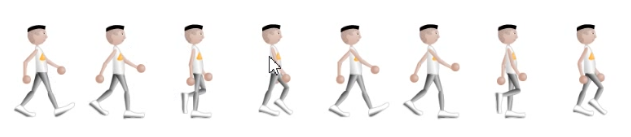

## 透明度opacity

`opacity`属性是CCS3中的透明度属性，使用此属性很容易将元素变得透明，属性值`0-1`，值越小元素变得更加透明。

IE8和早期版本中使用滤镜`filter: alpha(opacity=x);  这里x=0-100`改变元素的透明度。

## 精灵图

精灵图又叫图片拼合技术，其实就是多个图片集合在一张图片上，向服务器请求时，只需要请求一次即可，会降低向服务器的请求数量，并节省带宽。

使用Photoshop很容易拼接图片，像上面的图片，只需要向服务器请求一次，然后在浏览器中使用多个图片，可以用`background-image`属性。

## 表单

一些浏览器在输入框获取焦点时（点击输入框）会有一个蓝色轮廓。我们可以设置 input 样式为 `outline: none;` 来忽略该效果。使用 `:focus` 伪类选择器可以设置输入框在获取焦点时的样式。